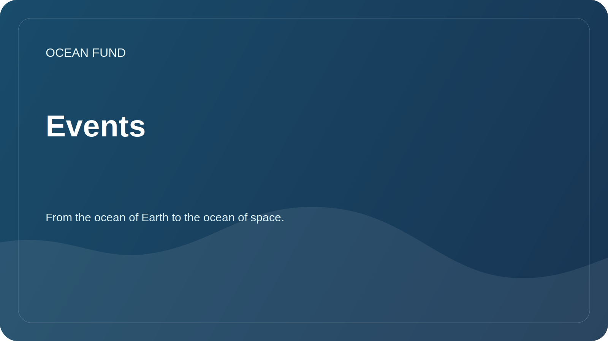

# Events

The section helps prepare the foundation’s participation in conferences, exhibitions, museum programs and public discussions.

## Participation formats

| Format | What is it suitable for? |
| --- | --- |
| Report | Introduce mission, research directions and open data |
| Panel discussion | Discuss ocean, climate, data, education and cross-sector partnerships |
| Stand | Show data maps, visualizations, educational materials |
| Workshop | Collaboratively explore a data source or research question |
| Partnership meeting | Agree on future joint activities |

## Event Card

When adding an event, specify:

- Name;
- city/country or online;
- dates;
- organizer;
- subject;
- link;
- application deadline;
- possible format for the fund's participation;
- status: `watching`, `applying`, `submitted`, `accepted`, `declined`, `completed`.

## Upcoming tasks

- Compile a list of relevant ocean, climate and science communication events.
- Prepare a universal application for the conference.
- Create a short presentation of the fund.

## Related public artifacts

- [`../public/conference-exhibition-one-pager.md`](../../public/en/conference-exhibition-one-pager.md)
- [`../public/event-application-pack.md`](../../public/en/event-application-pack.md)
- [`../public/indexes-and-publications-one-pager.md`](../../public/en/indexes-and-publications-one-pager.md)
