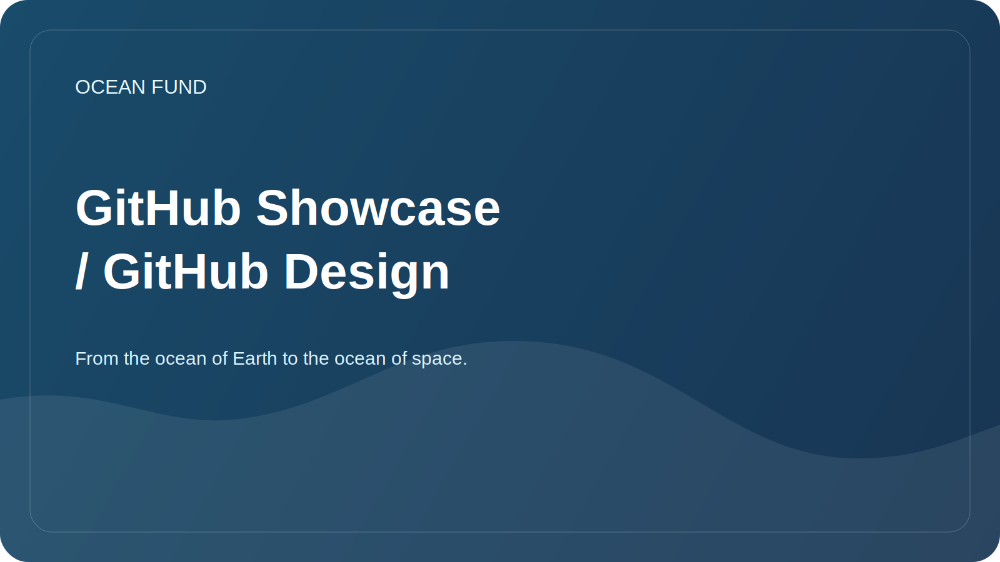

# GitHub Showcase / GitHub Design

This document is needed to make the Ocean Fund appear on GitHub as a living, clear and serious initiative, and not as a collection of internal drafts.

## What is what

### 1. GitHub profile

This is a user or organization page. This is where people first evaluate who you are, what you do, and whether they are worth reading further.

You need to fill out:

- name: `Ocean Fund` or approved official name;
- a short description in one sentence;
- avatar or logo;
- location;
- website;
- social links;
- pinned repositories.

### 2. Repository main page

This is `README.md` at the project root. It must answer four questions:

- What is this;
- why does it exist;
- what already exists;
- where to click next.

### 3. GitHub Pages or external storefront

This is a separate public page for those who are already cramped in the regular README. For Ocean Fund, the startup storefront must live in `public/` or on a separate external site.

### 4. Mandatory public layer

There are two required elements for the Ocean Fund, without which the public showcase is considered incomplete:

- partner-facing entry page;
- approved public mission copy.

Within a repository, this means that external navigation must lead to at least:

- [`partners.md`](../../public/en/partners.md)
- [`partner-one-pager.md`](../../public/en/partner-one-pager.md)
- [`mission-copy.md`](../../public/en/mission-copy.md)

For event-facing work, it is also advisable to keep nearby:

- [`conference-exhibition-one-pager.md`](../../public/en/conference-exhibition-one-pager.md)
- [`event-application-pack.md`](../../public/en/event-application-pack.md)

## Minimum required to complete in GitHub

### Profile

- avatar with a readable sign;
- short bio in Russian or English;
- link to the main repository;
- 3-6 pinned repositories;
- Profile README with mission, directions and ways to participate.

Шаблон профиля: [`github-profile-readme.md`](../../templates/github-profile-readme.md)

### Repository

- a short description of the repository;
- website URL;
- topics;
- social preview image;
- included Issues and Discussions;
- clear README;
- partner-facing showcase;
- partner one-pager;
- conference / exhibition one-pager;
- event application pack;
- public mission copy;
- first open issues.

## Recommended repository description

Russian version:

> The foundation's open database of ocean, climate, biodiversity, marine data, education and international partnerships.

English version:

> Open project hub for ocean, climate, biodiversity, marine data, education, AI, and partnerships.

## Recommended topics

- `ocean`
- `climate`
- `biodiversity`
- `marine-data`
- `open-science`
- `education`
- `ai-for-good`
- `research`
- `nonprofit`
- `ocean-literacy`

## What to add to your profile

If the profile is personal:

- main fund repository;
- showcase or project site;
- repository with data or notebooks;
- repository with presentations or public materials.

If the organization profile:

- main public hub;
- datasets or data registry;
- website or pages;
- research or notebooks;
- outreach or media kit;
- governance or documentation, if provided separately.

## What to put in the first public issues

- Research: Collect 10 priority ocean and climate topics.
- Data: design 5 verified open data sources.
- Outreach: prepare a short letter for universities and museums.
- Brand: approve the English spelling of the name and description.
- Website: bring `public/` to a single public version.
- Governance: define public contacts and licensing strategy.

See also [docs/60-github-issues.md](60-github-issues.md).

## Social Preview

For GitHub, it is useful to prepare a separate cover of size `1280x640`.

What should be on it:

- project name;
- short mission statement;
- 2-4 keywords, for example: `Ocean`, `Climate`, `Data`, `Partnerships`.

Draft source: [assets/brand/github-social-preview.svg](../../assets/brand/github-social-preview.svg)

## Showcase launch procedure

1. Publish the repository with the current `README.md`.
2. Confirm required public layer: `public/partners.md` and `public/mission-copy.md`.
3. Fill in the description, website, topics and social preview in the repository settings.
4. Turn on Discussions if you want public ideas and discussions.
5. Create 5-10 starting issues so that visitors can immediately see the movement.
6. Prepare a profile README for the user or organization.
7. Pin the repository to your profile.
8. If necessary, connect GitHub Pages or a separate site from `public/`.

## A good result looks like this

A person opens GitHub and immediately understands:

- this is not a random draft, but a formalized open project hub;
- the project is in an early stage, but honestly shows the structure and plan;
- Here you can already participate: research, help with data, translations, partnerships and materials.
