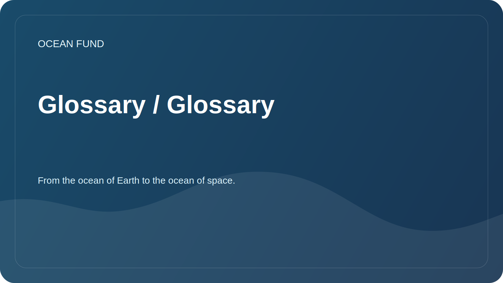

# Glossary / Glossary

A working glossary helps participants use common terms.

| Term | Meaning |
| --- | --- |
| Bathymetry | Measurement and description of the topography of the bottom of reservoirs and oceans |
| Biodiversity | Diversity of species, genes and ecosystems |
| Blue economy | Economic activities related to the ocean and water resources, subject to a sustainable approach |
| Citizen science | Public and volunteer participation in the collection, verification, or interpretation of scientific data |
| Data infrastructure | A set of rules, tools, formats and processes for working with data reliably |
| Marine pollution | Marine pollution from plastics, chemicals, noise, petroleum products and other impacts |
| Ocean literacy | Understanding the role of the ocean in human life and the impact of humans on the ocean |
| Open data | Data available for use subject to license and citation rules |
| Remote sensing | Remote sensing of the Earth, including satellite observations |
| Reproducibility | Possibility to repeat data analysis using the described method |

## Rule for adding terms

The new term should have a short definition, context of use and, if necessary, a link to the source.
