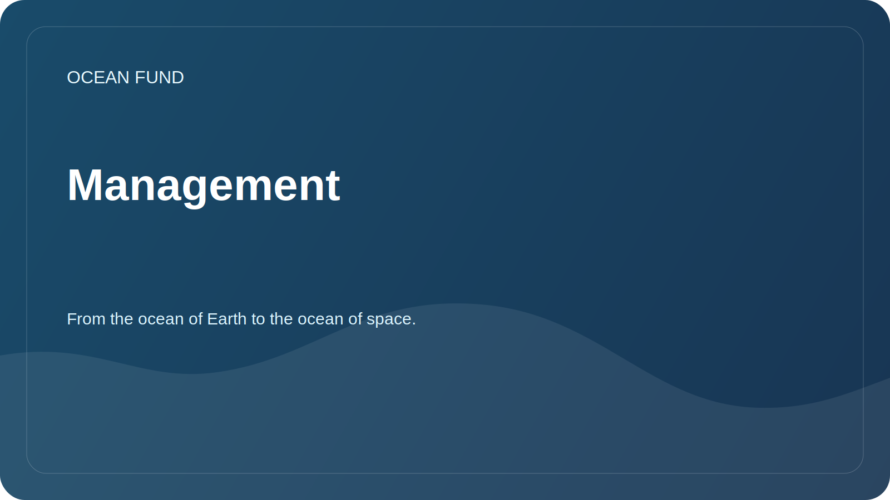

# Management

This document describes how the foundation maintains an open repository and accepts changes.

## Roles

| Role | Responsibility |
| --- | --- |
| Maintainers | Check the structure, safety, tone and compliance with the mission of the foundation |
| Research contributors | Suggests research questions, reviews, and sources |
| Data contributors | Add data sources, dataset descriptions and notebooks |
| Outreach contributors | Prepare materials for partnerships, events and communications |
| Reviewers | Checks facts, references, licenses and public suitability |

## How changes are accepted

1. Minor edits can be proposed via a pull request.
2. New directions, partnerships and public announcements are first discussed in issue.
3. Materials with unverified facts receive the status `needs verification`.
4. Materials with a risk of personal data will not be accepted until separate verification.

## Public readiness criteria

- the text refers only to the Ocean Foundation;
- no private contacts, tokens, financial details and personal documents;
- data sources and external assertions are explicitly stated;
- the tone is professional, calm and internationally understandable;
- there are no promises about non-existent results.

## Decision Log

Key decisions are recorded in [`project-management/decision-log.md`](../../project-management/decision-log.md).
