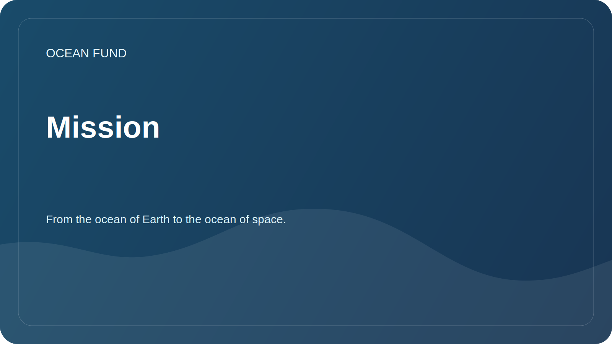

# Mission

This document describes the entire mission of the project. For external and repeatable public use, the approved set of wording is provided separately in [`mission-copy.md`](../../public/en/mission-copy.md).

## Briefly

The Ocean Foundation creates an open research, education and technology infrastructure that helps improve understanding of the ocean, protect marine ecosystems and engage society in responsible stewardship of the aquatic environment. The formula is important for the project: from the ocean of the Earth to the ocean of space.

## Why is this necessary?

The ocean regulates climate, supports biodiversity, and influences food systems, transportation, culture, economics, and coastal security. At the same time, data, knowledge and practical initiatives are often fragmented: scientific publications exist separately from educational programs, satellite data separately from local observations, and public initiatives separately from the expert agenda.

The Ocean Foundation strives to connect these contours into an understandable working system. In this logic, the ocean is seen not only as Earth's natural environment, but also as an intellectual bridge to satellite data, space observations, and the image of space as the next ocean of exploration.

## Mission objectives

| Task | Practical meaning |
| --- | --- |
| Research | Collect questions, data sources and analytical directions on the ocean |
| Link scales | Show how the Earth's ocean is connected to satellite observation, space data and horizon thinking |
| Explain | Making complex topics understandable for society, media, museums and educational platforms |
| Unite | Help scientists, developers, volunteers and partners find common projects |
| Check | Separate proven facts from hypotheses, drafts and plans |
| Develop infrastructure | Create open data catalogs, teaching materials and design templates |

## Principles

- Scientific accuracy is more important than grandiose statements.
- International understandability is more important than domestic jargon.
- Open data and reproducibility are more valuable than closed presentation promises.
- The ocean of Earth and the ocean of space are connected through science, data, education and imagination.
- Partnerships are described only after confirmation.
- Any public material should be useful to a scientist, developer, volunteer or event organizer.

## Current status

The Foundation is forming a public GitHub project headquarters: a knowledge structure, first research directions, a data map, partner communication templates and a development roadmap.
