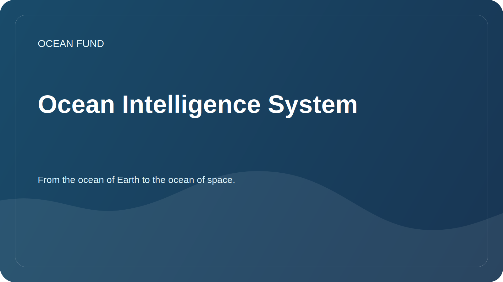

# Ocean Intelligence System

The document sets out a working protocol for in-depth exploration of the ocean topic. The ocean refers not only to the seas of the Earth, but also to a broader class of “oceanic worlds”: icy satellites, water planets, the space environment as an ocean of navigation, data and life.

## Target

Build a reproducible research system that helps the foundation:

- quickly enter into new oceanic topics;
- distinguish verified facts from hypotheses and beautiful but unsupported statements;
- find data, partners, events, grants and public events;
- prepare materials for the website, presentations, applications, lectures and GitHub tasks;
- connect the Earth's ocean with a cosmic perspective: remote sensing, astrobiology, ocean worlds, planetary habitability.

## Research Layers

| Layer | What we study | Result type |
| --- | --- | --- |
| Science | Ecosystems, climate, chemistry, bathymetry, astrobiology | overview, glossary, question card |
| Data | Datasets, APIs, licenses, metadata, quality | dataset card, register, notebook |
| Technologies | Satellites, sensors, autonomous platforms, ML, visualization | technical brief, prototype, issue |
| Institutions | Universities, museums, foundations, UN programs, space agencies | partner brief, list of contacts-roles |
| Publicity | Education, exhibitions, lectures, expeditions, media | script, presentation, publication |
| Strategy | Risks, ethics, sustainability, financing | road map, decision log |

## Duty cycle

1. Formulate the question: what exactly needs to be understood and for what decision of the fund.
2. Find primary sources: official data portals, scientific programs, publications, API documentation.
3. Divide materials into facts, interpretations, hypotheses and ideas.
4. Check access date, license, restrictions and applicability for public use.
5. Save the result in one of the following formats: review, source card, dataset card, partner brief, issue, presentation abstract.
6. Turn the result into action: task, letter to a partner, visualization, report, prototype, website update.

## Depth levels

| Level | When to use | What should happen |
| --- | --- | --- |
| Quick reconnaissance | New topic or partner request | 5-10 sources, term map, risks |
| In-Depth Review | Fund referral or public material | structured review, sources, gaps |
| Data dive | Is there open data or API? | dataset cards, query example, notebook plan |
| Strategic brief | We need a solution, an application, a partnership | conclusions, options for action, selection criteria |
| Public package | Material goes out | verified formulations, links, restrictions |

## Automation

Automation should work like research radar, not like a stream of noise.

Recommended regular contours:

| Circuit | Rhythm | What to track |
| --- | --- | --- |
| Ocean data radar | daily or 3 times a week | Copernicus Marine, OBIS, GEBCO, EMODnet, NOAA, Argo, NASA Ocean Color |
| Ocean worlds radar | weekly | NASA, ESA, astrobiology, Europa Clipper, Enceladus, Titan, planetary habitability |
| Partner radar | weekly | universities, museums, foundations, conferences, Ocean Decade |
| Grant and event radar | weekly | grants, calls for proposals, conferences, exhibitions |
| Repository hygiene | weekly | outdated links, open questions, materials with status `needs verification` |

Automation result format:

- date and period of monitoring;
- new sources or changes;
- why this is important for the fund;
- proposed actions;
- level of confidence;
- references and date of access;
- where to add the result in the repository.

## Basic Radar Sources

| Source | Role |
| --- | --- |
| Copernicus Marine Data Store | physical, biogeochemical and ice monitoring of the ocean |
| OBIS | global marine biodiversity data |
| GEBCO | bathymetry and global bottom relief models |
| EMODnet | European maritime data by subject area |
| NOAA / IOS | observations, buoys, weather and oceanographic data |
| Argo | ocean temperature and salinity profiles |
| NASA Ocean Color / PACE | satellite data on the ocean, atmosphere and ocean color |
| AN Ocean Decade | international ocean science and partnerships framework |
| NASA Ocean Worlds / Astrobiology | cosmic context of the oceans and the search for habitability |

## How to teach Codex to work in this project

For each new order it is useful to set:

- topic: the Earth's ocean, the cosmic ocean or the bridge between them;
- desired artifact: review, table, presentation, issue, dataset card, letter, prototype;
- depth: quick reconnaissance, deep review, data dive, strategic brief, public package;
- language: Russian, English or bilingual;
- status: draft, for internal decision, publicly prepared material;
- restrictions: sources, region, date, format, partner audience.

If there are no parameters, Codex should default to:

- start with primary sources and official data;
- make a short plan before the big work;
- store checked results in `docs/`, `research/`, `data/` or `project-management/`;
- do not present unconfirmed partnerships, grants and scientific findings as fact;
- mark where an expert check is needed.

## Upcoming research packages

| Plastic bag | Meaning | First result |
| --- | --- | --- |
| Ocean baseline | Quickly collect the scientific basis of the fund | map of directions and 30 key sources |
| Data atlas | Turn data sources into a working registry | 10 dataset cards and notebooks plan |
| Ocean worlds bridge | Connect oceanology, space and astrobiology | review "Earth as an Oceanic World" |
| Public narrative | Formulate a strong public language for the foundation | abstracts for the website and presentation |
| Partner map | Find real entry points into cooperation | list of organizations and contact formats |

## Index discipline

For the foundation, the index is not a secondary file, but a way to keep the topic alive.

The minimum that must be maintained at all times is:

- register of indexes and atlases;
- site summary и publication queues;
- repository engagement playbook;
- connection between index layer and issue layer.
