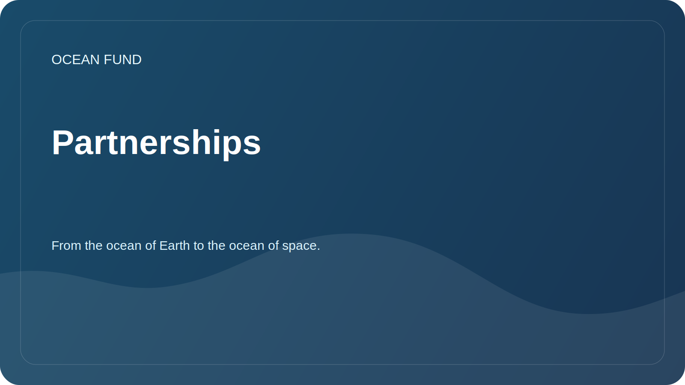

# Partnerships

The Ocean Foundation is open to collaboration with organizations that work on the ocean, climate, biodiversity, education, museum programs, data and science communication.

## Possible partners

| Type of organization | Possible format |
| --- | --- |
| University | Research projects, student practices, open seminars |
| Scientific centers | Collaborative reviews, methodologies, data catalogs |
| Museums and exhibition venues | Educational programs, visualizations, public lectures |
| Foundation | Supporting research, education and open infrastructure |
| Conferences | Report, panel, stand, side-events |
| Developers and open-source communities | Data analysis, visualization and cataloging tools |

## What should be in a partnership offer

- a brief description of the organization;
- theme of cooperation;
- expected contribution of each party;
- public result;
- timing and format of communication;
- data, license and publicity restrictions.

## What we are not declaring yet

- unconfirmed memorandum;
- numerical indicators without source;
- financing without approved public information;
- status of an international project without confirmed participants.

Communication templates are located in [`outreach/`](../../outreach/).

## Working affiliate cards

- [`outreach/collaboration-models.md`](../../outreach/collaboration-models.md) - cooperation models: research brief, data sprint, lecture, museum program, citizen science, ocean worlds bridge.
- [`outreach/ocean-organization-atlas.md`](../../outreach/ocean-organization-atlas.md) - a living atlas of organizations: international structures, scientific networks, NGOs, foundations, ocean tech, blue economy, museums, space.
