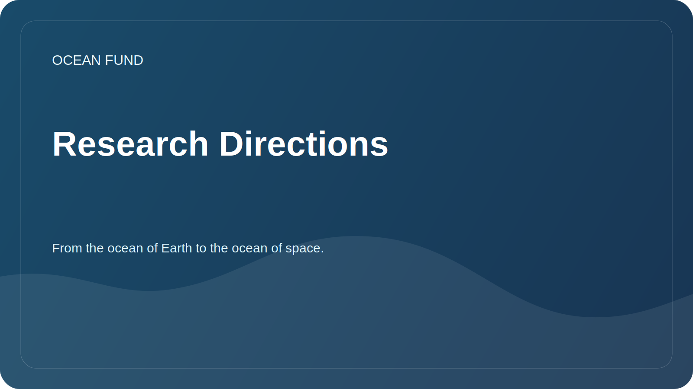

# Research Directions

This document links the foundation's mission to practical research questions. One of the key public motives of the project: from the ocean of the Earth to the ocean of space.

## Main directions

| Direction | Key Question | First results |
| --- | --- | --- |
| Oceanic biodiversity | How to describe the state of marine ecosystems based on open data? | Review of sources, map of species, list of indicators |
| Ocean and climate | How do ocean data help explain climate change? | Overview of variables, sources and visualizations |
| Marine pollution | What open data helps track pollution and human impacts? | Matrix of pollution types and sources |
| Ocean Data Infrastructure | How to make data accessible to researchers, developers and society? | Dataset registry, notebooks, metadata rules |
| Blue economy | How to discuss a sustainable maritime economy without making unsupported promises? | Terms, cases, sustainability criteria |
| Oceans and space | How to connect the Earth's ocean, satellite data, ocean worlds and astrobiology? | Review "Earth as an oceanic world", source map NASA/ESA/NOAA/Copernicus, narrative "from the ocean of Earth to the ocean of space" |

## Research operating system

For in-depth and regular study of the topic, the working protocol [`ocean-intelligence-system.md`](ocean-intelligence-system.md) is used. It describes depth levels, monitoring automation, result formats, and how the Codex deals with ocean topics.

## Requirements for research materials

- distinguish between fact, hypothesis and plan;
- indicate sources and date of access;
- avoid political and commercial statements without support;
- do not publish sensitive or personal information;
- write so that the material can be read by an international partner.
