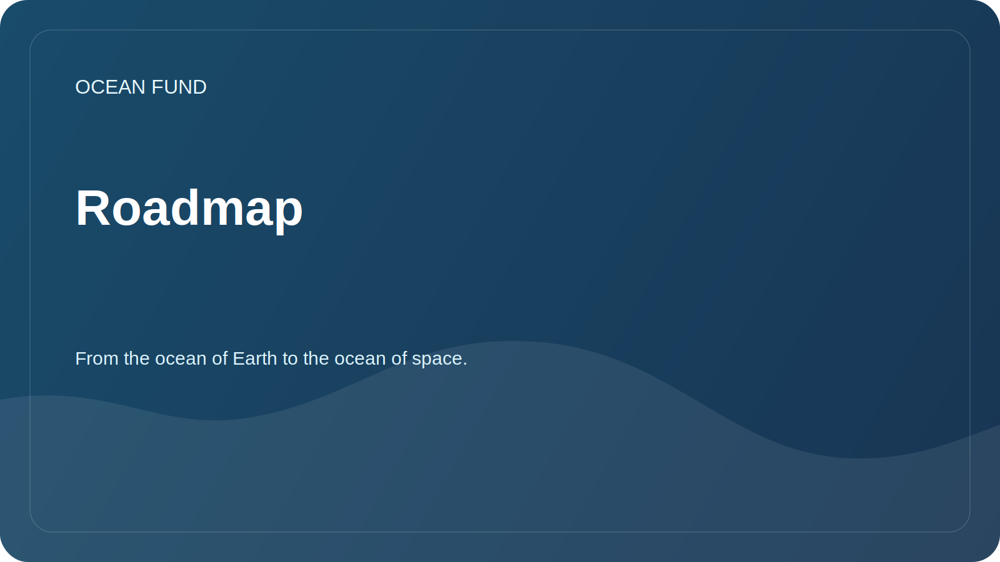

# Roadmap

The roadmap sets out the next practical steps. It does not promise ready-made results, but helps to coordinate the open tasks of the foundation.

## Stage 1. Public base

| Task | Status | Result |
| --- | --- | --- |
| Create a GitHub repository structure | in progress | README, docs, research, data, outreach, project-management |
| Separate public materials from internal ones | in progress | Safety and Inspection Rules |
| Prepare issues and PR templates | in progress | Single sign-on for tasks |
| Describe mission and directions | in progress | Documents for partners and participants |

## Stage 2: Research and Data

- Create a primary register of open data sources.
- Describe research questions on biodiversity, climate, pollution and data infrastructure.
- Prepare the first playable notebook without private data.
- Define rules for citing sources and licenses.

## Stage 3: Partnerships and Events

- Prepare a list of target organizations.
- Describe collaboration formats for universities, museums, conferences and foundations.
- Create the first letters and communication scripts.
- Prepare short versions of presentations for partners and events.

## Stage 4. Public outline

- Set up GitHub Discussions.
- Prepare GitHub Pages as a documentation showcase.
- Add repository topics and description.
- Make the first public release after checking the materials.

## Quality control

- Every statement about a partnership, data, or project status must have a source.
- All drafts are marked as draft or needs verification.
- Data containing personal, financial or sensitive information is not published.
