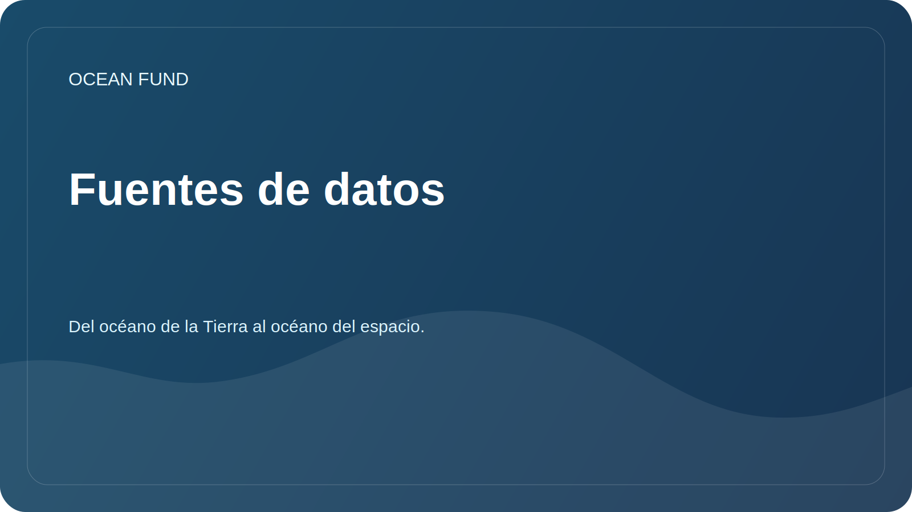

# Fuentes de datos

La Ocean Foundation explora fuentes de datos abiertos que pueden ser útiles para la investigación, la educación, la visualización y los proyectos comunitarios.

## Direcciones prioritarias

| Fuente | Valor potencial | Que comprobar |
| --- | --- | --- |
| Marinero Copérnico | Datos oceanográficos, modelos, seguimiento. | Licencias, API, cobertura espacial y temporal |
| OBIS | Datos de biodiversidad marina | Taxonomía, calidad de las publicaciones, citas. |
| GEBCO | Cuadrículas batimétricas y topografía del fondo. | Permiso, restricciones de uso. |
| EMODnet | Datos marítimos europeos sobre varios temas. | Accesibilidad, metadatos, estándares. |
| NOAA/IOS | Observaciones, boyas, datos meteorológicos y oceánicos. | API, actualizabilidad, regionalidad |
| FathomNet | Imágenes submarinas comentadas | Licencias, calidad de etiquetas, aplicabilidad para ML |
| Una Década de los Océanos | Programas, proyectos, marcos de cooperación. | Estado de las iniciativas y oportunidades de participación |
| Datos satelitales y batimétricos | Temperatura superficial, clorofila, hielo, profundidades. | Fuentes, procesamiento, errores. |

## Tarjeta de origen mínima

- Nombre;
- organización de operadores;
- enlace;
- tipo de datos;
- cobertura geográfica;
- cobertura temporal;
- licencia;
- método de acceso;
- ejemplo de aplicación de investigación;
- comprobaciones de fecha.

Un registro de trabajo detallado se encuentra en [`datasets-register.md`](../../data/datasets-register.md).
