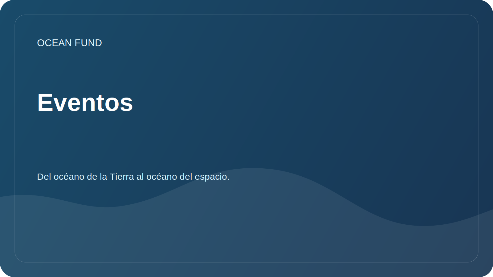

# Eventos

La sección ayuda a preparar la participación de la fundación en conferencias, exposiciones, programas de museos y debates públicos.

## Formatos de participación

| Formato | ¿Para qué es adecuado? |
| --- | --- |
| Informe | Introducir la misión, las direcciones de investigación y los datos abiertos. |
| Mesa redonda | Debatir sobre océanos, clima, datos, educación y asociaciones intersectoriales. |
| Pararse | Mostrar mapas de datos, visualizaciones y materiales educativos. |
| Taller | Explorar de forma colaborativa una fuente de datos o una pregunta de investigación. |
| Reunión de asociación | Acordar futuras actividades conjuntas |

## Tarjeta de evento

Al agregar un evento, especifique:

- Nombre;
- ciudad/país o en línea;
- fechas;
- organizador;
- sujeto;
- enlace;
- fecha límite de solicitud;
- posible formato para la participación del fondo;
- estado: `watching`, `applying`, `submitted`, `accepted`, `declined`, `completed`.

## Próximas tareas

- Compile una lista de eventos relevantes sobre comunicación científica, oceánica y climática.
- Prepare una solicitud universal para la conferencia.
- Crea una breve presentación del fondo.

## Artefactos públicos relacionados

- [`conference-exhibition-one-pager.md`](../../public/es/conference-exhibition-one-pager.md)
- [`event-application-pack.md`](../../public/es/event-application-pack.md)
- [`indexes-and-publications-one-pager.md`](../../public/es/indexes-and-publications-one-pager.md)
