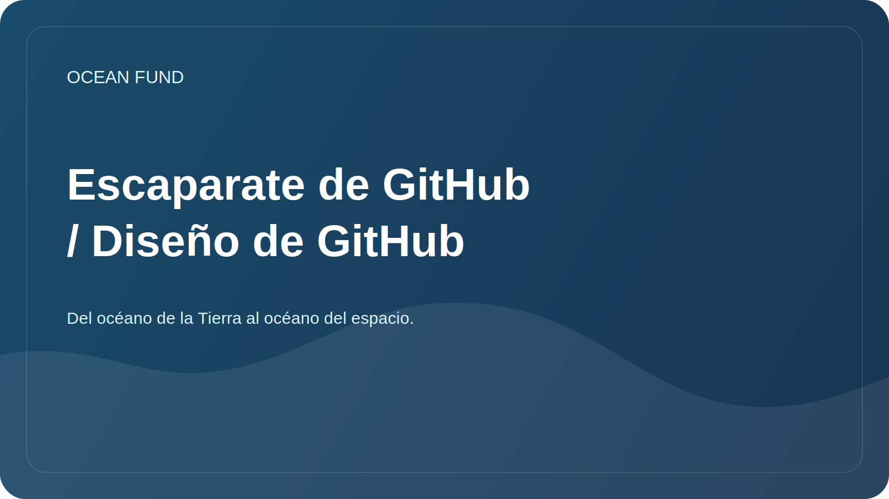

# Escaparate de GitHub / Diseño de GitHub

Este documento es necesario para que Ocean Fund aparezca en GitHub como una iniciativa viva, clara y seria, y no como una colección de borradores internos.

## ¿Qué es qué?

### 1. perfil de GitHub

Esta es una página de usuario u organización. Aquí es donde las personas evalúan por primera vez quién es usted, qué hace y si vale la pena seguir leyendo.

Necesitas completar:

- nombre: `Ocean Fund` o nombre oficial aprobado;
- una breve descripción en una frase;
- avatar o logotipo;
- ubicación;
- sitio web;
- vínculos sociales;
- repositorios anclados.

### 2. Página principal del repositorio

Este es `README.md` en la raíz del proyecto. Debe responder a cuatro preguntas:

- Qué es esto;
- por qué existe;
- lo que ya existe;
- dónde hacer clic en siguiente.

### 3. Páginas de GitHub o tienda externa

Esta es una página pública separada para aquellos que ya están limitados en el archivo README normal. Para Ocean Fund, la tienda inicial debe estar en `public/` o en un sitio externo separado.

### 4. Capa pública obligatoria

Hay dos elementos necesarios para el Fondo Océano, sin los cuales la exhibición pública se considera incompleta:

- página de entrada orientada a los socios;
- Copia de misión pública aprobada.

Dentro de un repositorio, esto significa que la navegación externa debe conducir al menos a:

- [`partners.md`](../../public/es/partners.md)
- [`partner-one-pager.md`](../../public/es/partner-one-pager.md)
- [`mission-copy.md`](../../public/es/mission-copy.md)

Para trabajos de cara a eventos, también es recomendable tener cerca:

- [`conference-exhibition-one-pager.md`](../../public/es/conference-exhibition-one-pager.md)
- [`event-application-pack.md`](../../public/es/event-application-pack.md)

## Mínimo requerido para completar en GitHub

### Perfil

- avatar con un letrero legible;
- breve biografía en ruso o inglés;
- enlace al repositorio principal;
- 3-6 repositorios fijados;
- Perfil README con misión, direcciones y formas de participar.

Plantilla de perfil: [`github-profile-readme.md`](../../templates/github-profile-readme.md)

### Repositorio

- una breve descripción del repositorio;
- URL del sitio web;
- temas;
- imagen de vista previa social;
- incluyó cuestiones y debates;
- borrar LÉAME;
- escaparate de cara a los socios;
- socio de una página;
- conferencia / exposición de una página;
- paquete de solicitud de eventos;
- copia de misión pública;
- primeros temas abiertos.

## Descripción del repositorio recomendado

Versión rusa:

> La base de datos abierta de la fundación sobre océanos, clima, biodiversidad, datos marinos, educación y asociaciones internacionales.

Versión en inglés:

> Centro de proyectos abierto para océanos, clima, biodiversidad, datos marinos, educación, inteligencia artificial y asociaciones.

## Temas recomendados

- `ocean`
- `climate`
- `biodiversity`
- `marine-data`
- `open-science`
- `education`
- `ai-for-good`
- `research`
- `nonprofit`
- `ocean-literacy`

## Qué agregar a tu perfil

Si el perfil es personal:

- depósito principal de fondos;
- escaparate o sitio del proyecto;
- repositorio con datos o cuadernos;
- repositorio con presentaciones o materiales públicos.

Si el perfil de la organización:

- principal centro público;
- conjuntos de datos o registro de datos;
- sitio web o páginas;
- investigaciones o cuadernos;
- kit de divulgación o medios;
- gobernanza o documentación, si se proporcionan por separado.

## Qué poner en los primeros números públicos.

- Investigación: recopile 10 temas prioritarios sobre océanos y clima.
- Datos: diseñar 5 fuentes de datos abiertos verificadas.
- Divulgación: preparar una breve carta para universidades y museos.
- Marca: aprobar la ortografía en inglés del nombre y la descripción.
- Sitio web: lleve `public/` a una única versión pública.
- Gobernanza: definir contactos públicos y estrategia de concesión de licencias.

Consulte también [docs/60-github-issues.md](60-github-issues.md).

## Vista previa social

Para GitHub, es útil preparar una portada separada de tamaño `1280x640`.

¿Qué debería contener?

- nombre del proyecto;
- breve declaración de misión;
- 2-4 palabras clave, por ejemplo: `Ocean`, `Climate`, `Data`, `Partnerships`.

Fuente del borrador: [`github-social-preview.svg`](../../assets/brand/github-social-preview.svg)

## Procedimiento de lanzamiento de escaparate

1. Publicar el repositorio con el `README.md` actual.
2. Confirme la capa pública requerida: `public/partners.md` y `public/mission-copy.md`.
3. Complete la descripción, el sitio web, los temas y la vista previa social en la configuración del repositorio.
4. Active Discusiones si desea ideas y debates públicos.
5. Cree entre 5 y 10 números iniciales para que los visitantes puedan ver el movimiento inmediatamente.
6. Prepare un perfil README para el usuario u organización.
7. Fija el repositorio a tu perfil.
8. Si es necesario, conecte páginas de GitHub o un sitio independiente de `public/`.

## Un buen resultado se ve así

Una persona abre GitHub e inmediatamente comprende:

- este no es un borrador aleatorio, sino un centro de proyecto abierto formalizado;
- el proyecto se encuentra en una etapa inicial, pero muestra honestamente la estructura y el plan;
- Aquí ya puedes participar: investigaciones, ayuda con datos, traducciones, colaboraciones y materiales.
