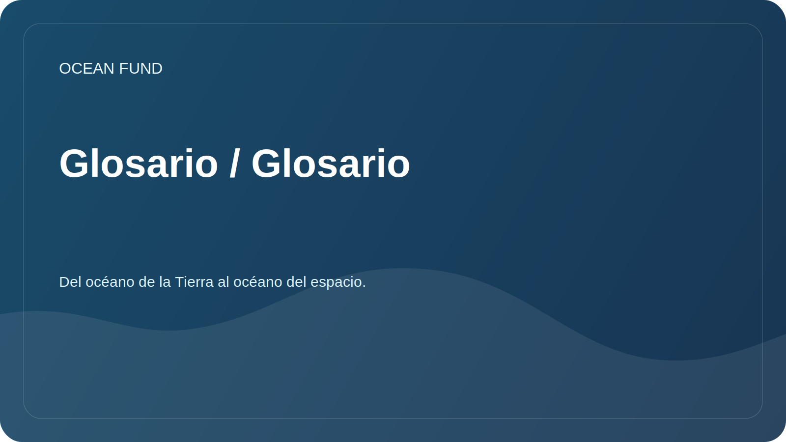

# Glosario / Glosario

Un glosario práctico ayuda a los participantes a utilizar términos comunes.

| Término | Significado |
| --- | --- |
| Batimetría | Medición y descripción de la topografía del fondo de embalses y océanos. |
| Biodiversidad | Diversidad de especies, genes y ecosistemas. |
| Economía azul | Actividades económicas relacionadas con el océano y los recursos hídricos, sujetas a un enfoque sostenible |
| Ciencia ciudadana | Participación pública y voluntaria en la recopilación, verificación o interpretación de datos científicos. |
| Infraestructura de datos | Un conjunto de reglas, herramientas, formatos y procesos para trabajar con datos de manera confiable. |
| Contaminación marina | Contaminación marina por plásticos, productos químicos, ruido, productos derivados del petróleo y otros impactos. |
| Alfabetización oceánica | Comprender el papel del océano en la vida humana y el impacto de los humanos en el océano. |
| Datos abiertos | Datos disponibles para uso sujeto a reglas de licencia y citación. |
| Teledetección | Teledetección de la Tierra, incluidas observaciones por satélite |
| Reproducibilidad | Posibilidad de repetir el análisis de datos utilizando el método descrito. |

## Regla para agregar términos

El nuevo término debe tener una definición breve, un contexto de uso y, si es necesario, un enlace a la fuente.
