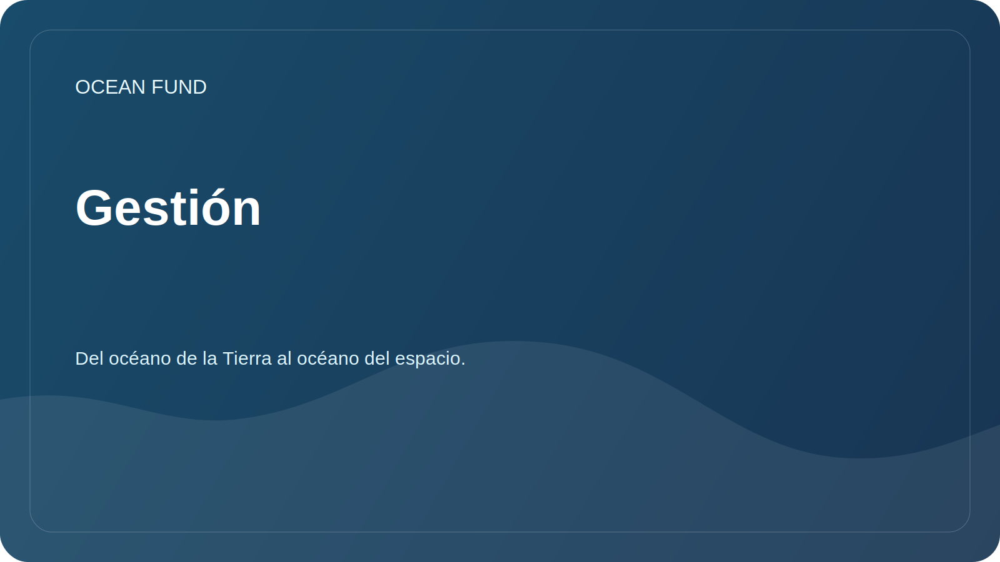

# Gestión

Este documento describe cómo la fundación mantiene un repositorio abierto y acepta cambios.

## Roles

| Role | Responsabilidad |
| --- | --- |
| mantenedores | Comprobar la estructura, seguridad, tono y cumplimiento de la misión de la fundación. |
| Colaboradores de la investigación | Sugiere preguntas de investigación, reseñas y fuentes. |
| Contribuyentes de datos | Agregue fuentes de datos, descripciones de conjuntos de datos y cuadernos |
| Colaboradores de divulgación | Preparar materiales para asociaciones, eventos y comunicaciones. |
| Revisores | Comprueba hechos, referencias, licencias e idoneidad pública. |

## Cómo se aceptan los cambios

1. Se pueden proponer ediciones menores mediante una solicitud de extracción.
2. En primer lugar se discuten nuevas direcciones, asociaciones y anuncios públicos.
3. Los materiales con hechos no verificados reciben el estado `needs verification`.
4. No se aceptarán materiales con riesgo de datos personales hasta que se realice una verificación por separado.

## Criterios de preparación pública

- el texto se refiere únicamente a la Fundación Océano;
- sin contactos privados, tokens, detalles financieros ni documentos personales;
- las fuentes de datos y las afirmaciones externas se indican explícitamente;
- el tono es profesional, tranquilo y comprensible a nivel internacional;
- No hay promesas sobre resultados inexistentes.

## Registro de decisiones

Las decisiones clave se registran en [`decision-log.md`](../../project-management/decision-log.md).
