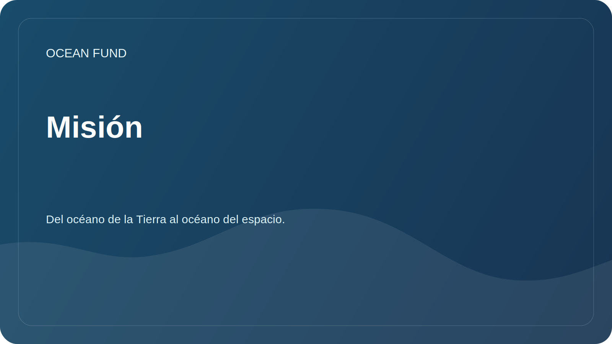

# Misión

Este documento describe toda la misión del proyecto. Para uso público externo y repetible, el conjunto de textos aprobados se presenta por separado en [`mission-copy.md`](../../public/es/mission-copy.md).

## Brevemente

La Ocean Foundation crea una infraestructura abierta de investigación, educación y tecnología que ayuda a mejorar la comprensión del océano, proteger los ecosistemas marinos e involucrar a la sociedad en la gestión responsable del medio ambiente acuático. La fórmula es importante para el proyecto: del océano de la Tierra al océano del espacio.

## ¿Por qué es esto necesario?

El océano regula el clima, sustenta la biodiversidad e influye en los sistemas alimentarios, el transporte, la cultura, la economía y la seguridad costera. Al mismo tiempo, los datos, los conocimientos y las iniciativas prácticas suelen estar fragmentados: las publicaciones científicas existen separadas de los programas educativos, los datos satelitales separados de las observaciones locales y las iniciativas públicas separadas de la agenda de expertos.

La Ocean Foundation se esfuerza por conectar estos contornos en un sistema de trabajo comprensible. En esta lógica, el océano es visto no sólo como el entorno natural de la Tierra, sino también como un puente intelectual hacia los datos satelitales, las observaciones espaciales y la imagen del espacio como el próximo océano de exploración.

## Objetivos de la misión

| Tarea | Significado práctico |
| --- | --- |
| Investigación | Recopile preguntas, fuentes de datos y direcciones analíticas sobre el océano. |
| escalas de enlace | Muestre cómo el océano de la Tierra está relacionado con la observación por satélite, los datos espaciales y el pensamiento sobre el horizonte. |
| Explicar | Hacer que temas complejos sean comprensibles para la sociedad, los medios, los museos y las plataformas educativas. |
| Unir | Ayude a científicos, desarrolladores, voluntarios y socios a encontrar proyectos comunes |
| Controlar | Separar hechos probados de hipótesis, borradores y planes. |
| Desarrollar infraestructura | Cree catálogos de datos abiertos, materiales didácticos y plantillas de diseño. |

## Principios

- La precisión científica es más importante que las declaraciones grandilocuentes.
- La comprensión internacional es más importante que la jerga nacional.
- Los datos abiertos y la reproducibilidad son más valiosos que las promesas de presentaciones cerradas.
- El océano de la Tierra y el océano del espacio están conectados a través de la ciencia, los datos, la educación y la imaginación.
- Las asociaciones se describen sólo después de la confirmación.
- Cualquier material público debe ser útil para un científico, desarrollador, voluntario u organizador de eventos.

## Estado actual

La Fundación está formando una sede pública del proyecto GitHub: una estructura de conocimiento, las primeras direcciones de investigación, un mapa de datos, plantillas de comunicación con los socios y una hoja de ruta de desarrollo.
