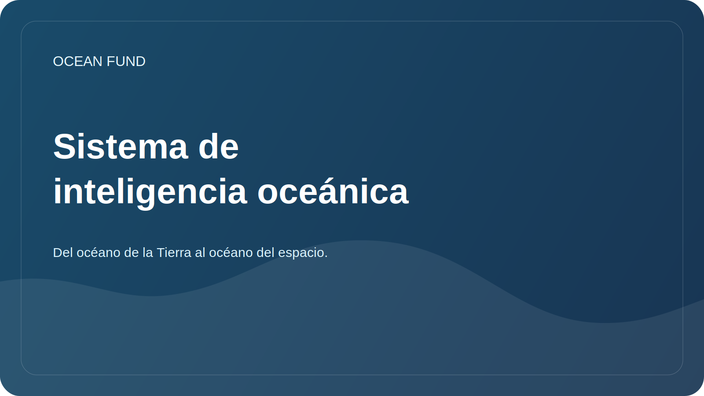

# Sistema de inteligencia oceánica

El documento establece un protocolo de trabajo para la exploración en profundidad del tema oceánico. El océano se refiere no sólo a los mares de la Tierra, sino también a una clase más amplia de “mundos oceánicos”: satélites helados, planetas acuáticos, el entorno espacial como océano de navegación, datos y vida.

## Objetivo

Construya un sistema de investigación reproducible que ayude a la fundación a:

- entrar rápidamente en nuevos temas oceánicos;
- distinguir hechos verificados de hipótesis y declaraciones hermosas pero sin fundamento;
- encontrar datos, socios, eventos, subvenciones y eventos públicos;
- preparar materiales para el sitio web, presentaciones, aplicaciones, conferencias y tareas de GitHub;
- conectar el océano de la Tierra con una perspectiva cósmica: teledetección, astrobiología, mundos oceánicos, habitabilidad planetaria.

## Capas de investigación

| Capa | lo que estudiamos | Tipo de resultado |
| --- | --- | --- |
| Ciencia | Ecosistemas, clima, química, batimetría, astrobiología. | descripción general, glosario, tarjeta de preguntas |
| Datos | Conjuntos de datos, API, licencias, metadatos, calidad | tarjeta de conjunto de datos, registro, cuaderno |
| Tecnologías | Satélites, sensores, plataformas autónomas, ML, visualización | resumen técnico, prototipo, edición |
| Instituciones | Universidades, museos, fundaciones, programas de la ONU, agencias espaciales | resumen del socio, lista de contactos-roles |
| Publicidad | Educación, exposiciones, conferencias, expediciones, medios de comunicación. | guión, presentación, publicación |
| Estrategia | Riesgos, ética, sostenibilidad, financiación. | hoja de ruta, registro de decisiones |

## ciclo de trabajo

1. Formule la pregunta: qué es exactamente lo que se debe entender y para qué decisión del fondo.
2. Encuentre fuentes primarias: portales de datos oficiales, programas científicos, publicaciones, documentación API.
3. Divida los materiales en hechos, interpretaciones, hipótesis e ideas.
4. Consulta fecha de acceso, licencia, restricciones y aplicabilidad para uso público.
5. Guarde el resultado en uno de los siguientes formatos: revisión, tarjeta de origen, tarjeta de conjunto de datos, resumen del socio, número, resumen de presentación.
6. Convierta el resultado en acción: tarea, carta a un socio, visualización, informe, prototipo, actualización del sitio web.

## Niveles de profundidad

| Nivel | cuando usar | ¿Qué debería pasar? |
| --- | --- | --- |
| reconocimiento rápido | Nuevo tema o solicitud de socio | 5-10 fuentes, mapa de términos, riesgos |
| Revisión en profundidad | Referencia de fondos o material público | revisión estructurada, fuentes, lagunas |
| Buceo de datos | ¿Existen datos abiertos o API? | tarjetas de conjunto de datos, ejemplo de consulta, plan de cuaderno |
| Resumen estratégico | Necesitamos una solución, una aplicación, una asociación. | conclusiones, opciones de acción, criterios de selección |
| Paquete público | el material se acaba | formulaciones verificadas, enlaces, restricciones |

## Automatización

La automatización debería funcionar como un radar de investigación, no como una corriente de ruido.

Contornos regulares recomendados:

| Circuito | Ritmo | Qué rastrear |
| --- | --- | --- |
| Radar de datos oceánicos | diariamente o 3 veces por semana | Copernicus Marine, OBIS, GEBCO, EMODnet, NOAA, Argo, NASA Ocean Color |
| Radar de mundos oceánicos | semanalmente | NASA, ESA, astrobiología, Europa Clipper, Encelado, Titán, habitabilidad planetaria |
| Radar asociado | semanalmente | universidades, museos, fundaciones, conferencias, Ocean Decade |
| Radar de subvenciones y eventos | semanalmente | subvenciones, convocatorias de propuestas, congresos, exposiciones |
| Higiene del repositorio | semanalmente | enlaces obsoletos, preguntas abiertas, materiales con estado `needs verification` |

Formato de resultado de automatización:

- fecha y período de seguimiento;
- nuevas fuentes o cambios;
- por qué esto es importante para el fondo;
- acciones propuestas;
- nivel de confianza;
- referencias y fecha de acceso;
- dónde agregar el resultado en el repositorio.

## Fuentes de radar básicas

| Fuente | Role |
| --- | --- |
| Almacén de datos marinos de Copernicus | Vigilancia física, biogeoquímica y del hielo del océano. |
| OBIS | datos globales de biodiversidad marina |
| GEBCO | Batimetría y modelos globales de relieve del fondo. |
| EMODnet | Datos marítimos europeos por área temática |
| NOAA/IOS | observaciones, boyas, datos meteorológicos y oceanográficos |
| argo | Perfiles de temperatura y salinidad del océano. |
| Color del océano de la NASA / PACE | datos satelitales sobre el océano, la atmósfera y el color del océano |
| Una Década de los Océanos | marco internacional de asociaciones y ciencias oceánicas |
| Mundos oceánicos de la NASA / Astrobiología | Contexto cósmico de los océanos y la búsqueda de habitabilidad. |

## Cómo enseñar a Codex a trabajar en este proyecto

Para cada nuevo pedido es útil configurar:

- Tema: el océano de la Tierra, el océano cósmico o el puente entre ellos;
- artefacto deseado: revisión, tabla, presentación, edición, tarjeta de conjunto de datos, carta, prototipo;
- profundidad: reconocimiento rápido, revisión profunda, análisis de datos, resumen estratégico, paquete público;
- idioma: ruso, inglés o bilingüe;
- estado: borrador, para decisión interna, material preparado públicamente;
- restricciones: fuentes, región, fecha, formato, audiencia de socios.

Si no hay parámetros, el Codex debería utilizar de forma predeterminada:

- comenzar con fuentes primarias y datos oficiales;
- haga un plan breve antes del gran trabajo;
- almacenar los resultados verificados en `docs/`, `research/`, `data/` o `project-management/`;
- no presentar asociaciones, subvenciones y hallazgos científicos no confirmados como hechos;
- marque dónde se necesita un control experto.

## Próximos paquetes de investigación

| bolsa de plastico | Significado | Primer resultado |
| --- | --- | --- |
| Línea de base del océano | Recopilar rápidamente la base científica del fondo. | mapa de direcciones y 30 fuentes clave |
| Atlas de datos | Convierta las fuentes de datos en un registro funcional | Plan de 10 tarjetas de conjunto de datos y cuadernos. |
| Puente de los mundos oceánicos | Conecta la oceanología, el espacio y la astrobiología | reseña "La Tierra como mundo oceánico" |
| Narrativa pública | Formular un lenguaje público sólido para la fundación. | resúmenes para el sitio web y presentación |
| Mapa de socios | Encuentre puntos de entrada reales a la cooperación | lista de organizaciones y formatos de contacto |

## disciplina índice

Para la fundación, el índice no es un archivo secundario, sino una forma de mantener vivo el tema.

El mínimo que se debe mantener en todo momento es:

- registro de índices y atlas;
- resumen del sitio y colas de publicación;
- manual de participación en el repositorio;
- conexión entre la capa de índice y la capa de emisión.
