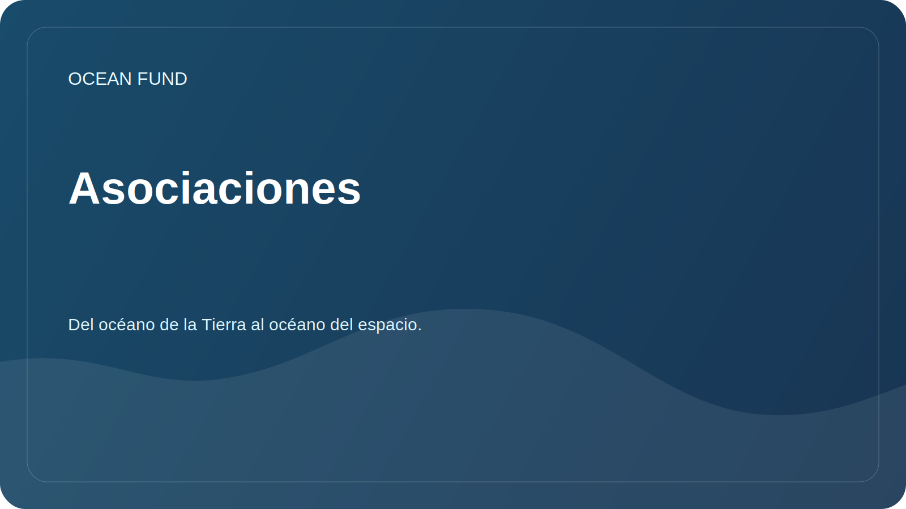

# Asociaciones

La Ocean Foundation está abierta a la colaboración con organizaciones que trabajan en el océano, el clima, la biodiversidad, la educación, los programas de museos, los datos y la comunicación científica.

## Posibles socios

| Tipo de organización | Posible formato |
| --- | --- |
| Universidad | Proyectos de investigación, prácticas estudiantiles, seminarios abiertos. |
| Centros científicos | Revisiones colaborativas, metodologías, catálogos de datos. |
| Museos y salas de exposiciones. | Programas educativos, visualizaciones, conferencias públicas. |
| Base | Apoyar la investigación, la educación y la infraestructura abierta |
| Conferencias | Informe, panel, stand, eventos paralelos |
| Desarrolladores y comunidades de código abierto | Herramientas de análisis, visualización y catalogación de datos. |

## ¿Qué debería haber en una oferta de asociación?

- una breve descripción de la organización;
- tema de cooperación;
- contribución esperada de cada parte;
- resultado público;
- momento y formato de la comunicación;
- restricciones de datos, licencias y publicidad.

## Lo que aún no declaramos

- memorando no confirmado;
- indicadores numéricos sin fuente;
- financiamiento sin información pública aprobada;
- Estado de un proyecto internacional sin participantes confirmados.

Las plantillas de comunicación se encuentran en [`outreach/`](../../outreach/).

## Tarjetas de afiliados que funcionan

- [`collaboration-models.md`](../../outreach/collaboration-models.md) - modelos de cooperación: resumen de investigación, sprint de datos, conferencia, programa de museo, ciencia ciudadana, puente entre mundos oceánicos.
- [`ocean-organization-atlas.md`](../../outreach/ocean-organization-atlas.md) - un atlas viviente de organizaciones: estructuras internacionales, redes científicas, ONG, fundaciones, tecnología oceánica, economía azul, museos, espacio.
