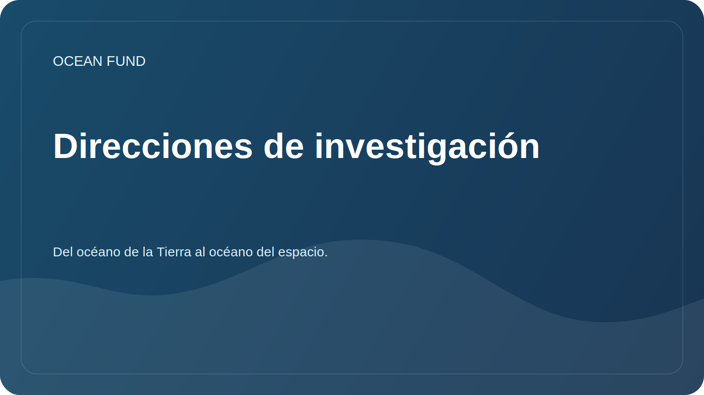

# Direcciones de investigación

Este documento vincula la misión de la fundación con preguntas de investigación prácticas. Uno de los motivos públicos clave del proyecto: del océano de la Tierra al océano del espacio.

## Direcciones principales

| Dirección | Pregunta clave | Primeros resultados |
| --- | --- | --- |
| Biodiversidad oceánica | ¿Cómo describir el estado de los ecosistemas marinos a partir de datos abiertos? | Revisión de fuentes, mapa de especies, lista de indicadores. |
| Océano y clima | ¿Cómo ayudan los datos oceánicos a explicar el cambio climático? | Descripción general de variables, fuentes y visualizaciones |
| Contaminación marina | ¿Qué datos abiertos ayudan a rastrear la contaminación y los impactos humanos? | Matriz de tipos y fuentes de contaminación. |
| Infraestructura de datos oceánicos | ¿Cómo hacer que los datos sean accesibles para los investigadores, los desarrolladores y la sociedad? | Registro de conjuntos de datos, cuadernos, reglas de metadatos. |
| Economía azul | ¿Cómo discutir una economía marítima sostenible sin hacer promesas sin fundamento? | Términos, casos, criterios de sostenibilidad. |
| Océanos y espacio | ¿Cómo conectar los océanos de la Tierra, los datos satelitales, los mundos oceánicos y la astrobiología? | Reseña "La Tierra como mundo oceánico", mapa fuente NASA/ESA/NOAA/Copernicus, narrativa "del océano de la Tierra al océano del espacio" |

## Sistema operativo de investigación

Para el estudio profundo y periódico del tema se utiliza el protocolo de trabajo [`ocean-intelligence-system.md`](ocean-intelligence-system.md). Describe los niveles de profundidad, la automatización del seguimiento, los formatos de los resultados y cómo el Codex aborda los temas oceánicos.

## Requisitos para materiales de investigación.

- distinguir entre hecho, hipótesis y plan;
- indicar fuentes y fecha de acceso;
- evitar declaraciones políticas y comerciales sin sustento;
- no publicar información sensible o personal;
- escribir para que el material pueda ser leído por un socio internacional.
