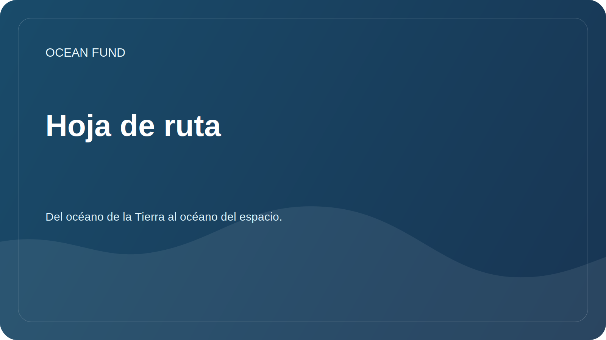

# Hoja de ruta

La hoja de ruta establece los próximos pasos prácticos. No promete resultados ya preparados, pero ayuda a coordinar las tareas pendientes de la fundación.

## Etapa 1. Base pública

| Tarea | Estado | Resultado |
| --- | --- | --- |
| Crear una estructura de repositorio de GitHub | en curso | README, documentos, investigación, datos, divulgación, gestión de proyectos |
| Separar los materiales públicos de los internos. | en curso | Reglas de seguridad e inspección |
| Preparar problemas y plantillas de relaciones públicas | en curso | Inicio de sesión único para tareas |
| Describir la misión y las direcciones. | en curso | Documentos para socios y participantes. |

## Etapa 2: Investigación y datos

- Crear un registro primario de fuentes de datos abiertos.
- Describir preguntas de investigación sobre biodiversidad, clima, contaminación e infraestructura de datos.
- Prepara el primer portátil jugable sin datos privados.
- Definir reglas para citar fuentes y licencias.

## Etapa 3: Asociaciones y Eventos

- Prepare una lista de organizaciones objetivo.
- Describir formatos de colaboración para universidades, museos, congresos y fundaciones.
- Crea las primeras cartas y guiones de comunicación.
- Preparar versiones cortas de presentaciones para socios y eventos.

## Etapa 4. Esquema público

- Configure debates de GitHub.
- Prepare páginas de GitHub como muestra de documentación.
- Agregue temas y descripciones del repositorio.
- Haga el primer lanzamiento público después de verificar los materiales.

## Control de calidad

- Cada declaración sobre una asociación, datos o estado de un proyecto debe tener una fuente.
- Todos los borradores están marcados como borrador o necesitan verificación.
- No se publican datos que contengan información personal, financiera o sensible.
