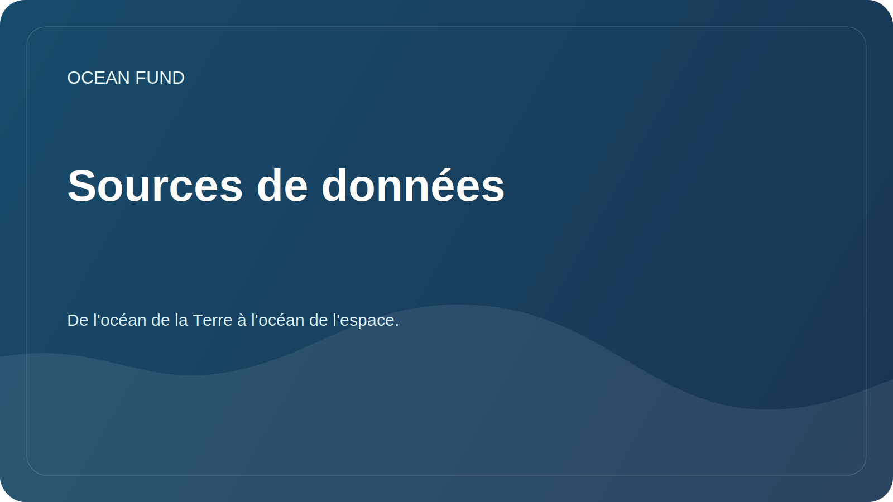

# Sources de données

La Fondation Océan explore les sources de données ouvertes qui peuvent être utiles pour la recherche, l'éducation, la visualisation et les projets communautaires.

## Orientations prioritaires

| Source | Valeur potentielle | Que vérifier |
| --- | --- | --- |
| Copernic Marin | Données océanographiques, modèles, surveillance | Licences, API, couverture spatiale et temporelle |
| OBIS | Données sur la biodiversité marine | Taxonomie, qualité des publications, citations |
| GEBCO | Grilles bathymétriques et topographie des fonds | Autorisation, restrictions d'utilisation |
| EMODnet | Des données maritimes européennes sur plusieurs thématiques | Accessibilité, métadonnées, normes |
| NOAA/IOS | Observations, bouées, données météorologiques et océaniques | API, possibilité de mise à jour, régionalité |
| FathomNet | Images sous-marines annotées | Licences, qualité des labels, applicabilité du ML |
| Une décennie pour les océans | Programmes, projets, cadres de coopération | Statut des initiatives et opportunités de participation |
| Données satellitaires et bathymétriques | Température de surface, chlorophylle, glace, profondeurs | Sources, traitements, erreurs |

## Carte source minimale

- Nom;
- organisation des opérateurs ;
- lien;
- type de données ;
- couverture géographique;
- couverture temporaire;
- licence;
- méthode d'accès ;
- exemple d'application de recherche;
- contrôles de dates.

Un registre de travail détaillé se trouve dans [`data/datasets-register.md`](../../data/datasets-register.md).
