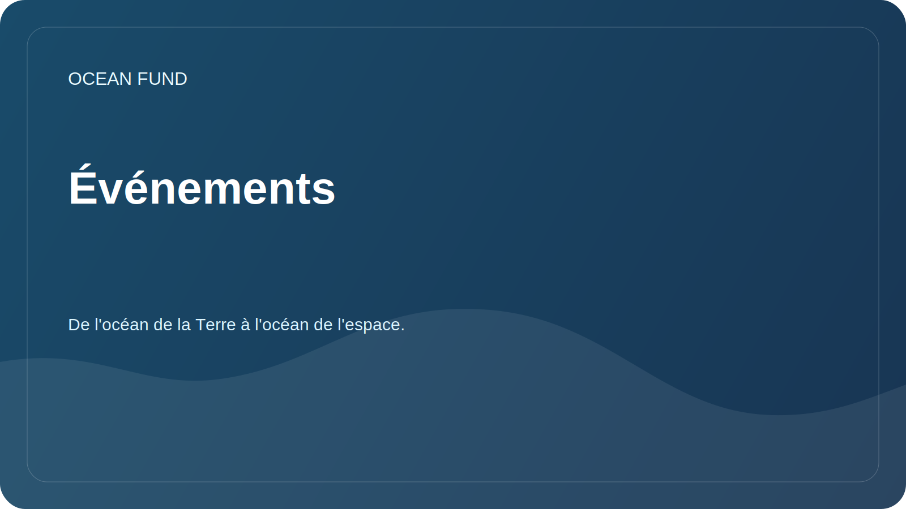

# Événements

La section aide à préparer la participation de la fondation à des conférences, des expositions, des programmes muséaux et des débats publics.

## Formats de participation

| Format | A quoi convient-il ? |
| --- | --- |
| Rapport | Présenter la mission, les orientations de recherche et les données ouvertes |
| Table ronde | Discutez des océans, du climat, des données, de l’éducation et des partenariats intersectoriels |
| Rester | Afficher des cartes de données, des visualisations et du matériel pédagogique |
| Atelier | Explorer de manière collaborative une source de données ou une question de recherche |
| Réunion de partenariat | Convenir des futures activités conjointes |

## Carte d'événement

Lors de l'ajout d'un événement, précisez :

- Nom;
- ville/pays ou en ligne ;
- dates;
- organisateur;
- sujet;
- lien;
- date limite de candidature ;
- format possible pour la participation du fonds ;
- statut : `watching`, `applying`, `submitted`, `accepted`, `declined`, `completed`.

## Tâches à venir

- Compilez une liste d’événements pertinents en matière de communication sur l’océan, le climat et la science.
- Préparez une application universelle pour la conférence.
- Créez une brève présentation du fonds.

## Artefacts publics associés

- [`../public/conference-exhibition-one-pager.md`](../../public/fr/conference-exhibition-one-pager.md)
- [`../public/event-application-pack.md`](../../public/fr/event-application-pack.md)
- [`../public/indexes-and-publications-one-pager.md`](../../public/fr/indexes-and-publications-one-pager.md)
