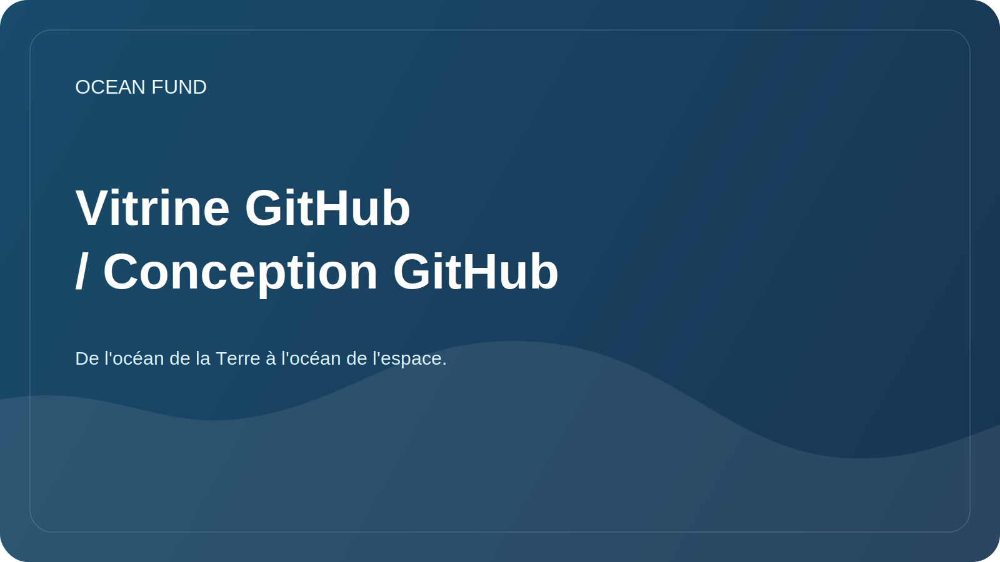

# Vitrine GitHub / Conception GitHub

Ce document est nécessaire pour que le Fonds Océan apparaisse sur GitHub comme une initiative vivante, claire et sérieuse, et non comme un recueil de brouillons internes.

## Qu'est-ce que c'est quoi

### 1. Profil GitHub

Il s'agit d'une page d'utilisateur ou d'organisation. C’est là que les gens évaluent pour la première fois qui vous êtes, ce que vous faites et s’ils valent la peine d’être lus davantage.

Vous devez remplir :

- nom : `Ocean Fund` ou nom officiel approuvé ;
- une brève description en une phrase ;
- avatar ou logo ;
- emplacement;
- site web;
- liens sociaux;
- référentiels épinglés.

### 2. Page principale du référentiel

Il s'agit de `README.md` à la racine du projet. Il doit répondre à quatre questions :

- Qu'est-ce que c'est;
- pourquoi existe-t-il ;
- ce qui existe déjà ;
- où cliquer ensuite.

### 3. Pages GitHub ou vitrine externe

Il s'agit d'une page publique distincte pour ceux qui sont déjà à l'étroit dans le README habituel. Pour Ocean Fund, la vitrine de la startup doit résider dans `public/` ou sur un site externe distinct.

### 4. Couche publique obligatoire

Deux éléments sont requis pour le Fonds Océan, sans lesquels la vitrine publique est considérée comme incomplète :

- page d'entrée destinée aux partenaires ;
- copie de mission publique approuvée.

Au sein d'un référentiel, cela signifie que la navigation externe doit conduire au minimum à :

- [`partners.md`](../../public/fr/partners.md)
- [`partner-one-pager.md`](../../public/fr/partner-one-pager.md)
- [`mission-copy.md`](../../public/fr/mission-copy.md)

Pour les travaux événementiels, il est également conseillé de conserver à proximité :

- [`conference-exhibition-one-pager.md`](../../public/fr/conference-exhibition-one-pager.md)
- [`event-application-pack.md`](../../public/fr/event-application-pack.md)

## Minimum requis pour compléter dans GitHub

### Profil

- avatar avec un signe lisible ;
- courte biographie en russe ou en anglais ;
- lien vers le référentiel principal ;
- 3 à 6 référentiels épinglés ;
- Profil README avec la mission, les orientations et les moyens de participer.

Modèle de profil : [`github-profile-readme.md`](../../templates/github-profile-readme.md)

### Dépôt

- une brève description du référentiel ;
- URL du site Web ;
- sujets ;
- image d'aperçu sociale ;
- inclus les problèmes et les discussions ;
- effacer le fichier README ;
- vitrine destinée aux partenaires ;
- une page partenaire ;
- conférence/exposition d'une page;
- pack de candidature pour événements ;
- copie de mission publique ;
- premiers problèmes ouverts.

## Description du référentiel recommandé

Version russe :

> La base de données ouverte de la fondation sur l'océan, le climat, la biodiversité, les données marines, l'éducation et les partenariats internationaux.

Version anglaise :

> Centre de projets ouvert pour l'océan, le climat, la biodiversité, les données marines, l'éducation, l'IA et les partenariats.

## Thèmes recommandés

- `ocean`
- `climate`
- `biodiversity`
- `marine-data`
- `open-science`
- `education`
- `ai-for-good`
- `research`
- `nonprofit`
- `ocean-literacy`

## Que ajouter à votre profil

Si le profil est personnel :

- référentiel principal de fonds ;
- site vitrine ou projet ;
- référentiel avec des données ou des cahiers ;
- référentiel avec des présentations ou des documents publics.

Si le profil de l'organisation :

- principal pôle public ;
- ensembles de données ou registre de données ;
- site Web ou pages ;
- recherches ou cahiers;
- kit de sensibilisation ou média ;
- la gouvernance ou la documentation, si elles sont fournies séparément.

## Que mettre dans les premiers numéros publics

- Recherche : Recueillez 10 sujets prioritaires sur l’océan et le climat.
- Données : concevoir 5 sources de données ouvertes vérifiées.
- Error 504 (Server Error)!!1504.That’s an error.There was an error. Please try again later.That’s all we know.
- Marque : approuvez l’orthographe anglaise du nom et de la description.
- Site Web : apportez `public/` à une seule version publique.
- Gouvernance : définir les contacts publics et la stratégie de licence.

Voir aussi [docs/60-github-issues.md](60-github-issues.md).

## Aperçu social

Pour GitHub, il est utile de préparer une couverture distincte de taille `1280x640`.

Que devrait-il y avoir dessus :

- nom du projet ;
- bref énoncé de mission ;
- 2 à 4 mots-clés, par exemple : `Ocean`, `Climate`, `Data`, `Partnerships`.

Source brouillon : [actifs/marque/github-social-preview.svg](../../assets/brand/github-social-preview.svg)

## Procédure de lancement de la vitrine

1. Publiez le référentiel avec le `README.md` actuel.
2. Confirmez la couche publique requise : `public/partners.md` et `public/mission-copy.md`.
3. Remplissez la description, le site Web, les sujets et l'aperçu social dans les paramètres du référentiel.
4. Activez les discussions si vous souhaitez des idées et des discussions publiques.
5. Créez 5 à 10 numéros de départ afin que les visiteurs puissent immédiatement voir le mouvement.
6. Préparez un fichier README de profil pour l'utilisateur ou l'organisation.
7. Épinglez le référentiel à votre profil.
8. Si nécessaire, connectez les pages GitHub ou un site distinct de `public/`.

## Un bon résultat ressemble à ceci

Une personne ouvre GitHub et comprend immédiatement :

- il ne s’agit pas d’une ébauche aléatoire, mais d’un pôle de projet ouvert et formalisé ;
- le projet en est à ses débuts, mais montre honnêtement la structure et le plan ;
- Ici, vous pouvez déjà participer : recherche, aide avec les données, traductions, partenariats et matériels.
