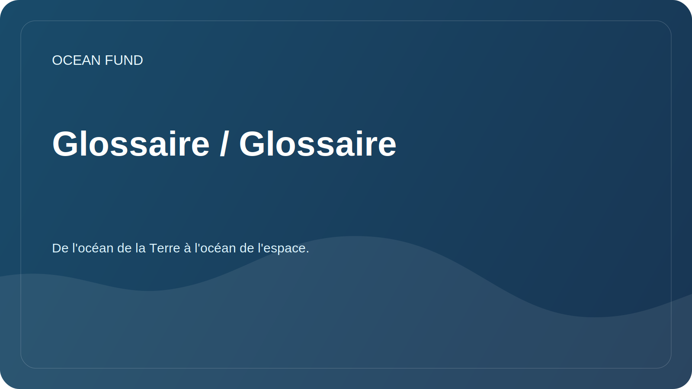

# Glossaire / Glossaire

Un glossaire de travail aide les participants à utiliser des termes courants.

| Terme | Signification |
| --- | --- |
| Bathymétrie | Mesure et description de la topographie du fond des réservoirs et des océans |
| Biodiversité | Diversité des espèces, des gènes et des écosystèmes |
| Économie bleue | Activités économiques liées à l’océan et aux ressources en eau, soumises à une approche durable |
| Science citoyenne | Participation du public et des bénévoles à la collecte, à la vérification ou à l'interprétation de données scientifiques |
| Infrastructure de données | Un ensemble de règles, d'outils, de formats et de processus pour travailler avec des données de manière fiable |
| Pollution marine | Pollution marine due aux plastiques, aux produits chimiques, au bruit, aux produits pétroliers et à d'autres impacts |
| Connaissance des océans | Comprendre le rôle de l'océan dans la vie humaine et l'impact des humains sur l'océan |
| Données ouvertes | Données disponibles pour une utilisation soumise aux règles de licence et de citation |
| Télédétection | Télédétection de la Terre, y compris les observations par satellite |
| Reproductibilité | Possibilité de répéter l'analyse des données en utilisant la méthode décrite |

## Règle d'ajout de termes

Le nouveau terme doit avoir une brève définition, un contexte d'utilisation et, si nécessaire, un lien vers la source.
