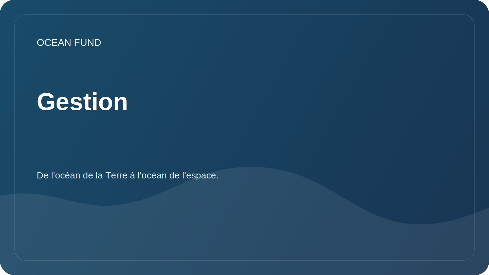

# Gestion

Ce document décrit comment la fondation maintient un référentiel ouvert et accepte les modifications.

## Rôles

| Rôle | Responsabilité |
| --- | --- |
| Mainteneurs | Vérifier la structure, la sécurité, le ton et le respect de la mission de la fondation |
| Contributeurs à la recherche | Suggère des questions de recherche, des critiques et des sources |
| Contributeurs de données | Ajoutez des sources de données, des descriptions d'ensembles de données et des blocs-notes |
| Contributeurs de sensibilisation | Préparer le matériel pour les partenariats, les événements et les communications |
| Réviseurs | Vérifie les faits, les références, les licences et l'aptitude publique |

## Comment les modifications sont acceptées

1. Des modifications mineures peuvent être proposées via une pull request.
2. Les nouvelles orientations, partenariats et annonces publiques sont d'abord discutés dans le numéro.
3. Les documents avec des faits non vérifiés reçoivent le statut `needs verification`.
4. Les documents présentant un risque de données personnelles ne seront pas acceptés jusqu'à vérification séparée.

## Critères de préparation du public

- le texte fait uniquement référence à la Fondation Océan ;
- pas de contacts privés, de jetons, de détails financiers et de documents personnels ;
- les sources de données et les assertions externes sont explicitement indiquées ;
- le ton est professionnel, calme et compréhensible au niveau international ;
- il n'y a aucune promesse concernant des résultats inexistants.

## Journal de décision

Les décisions clés sont enregistrées dans [`project-management/decision-log.md`](../../project-management/decision-log.md).
