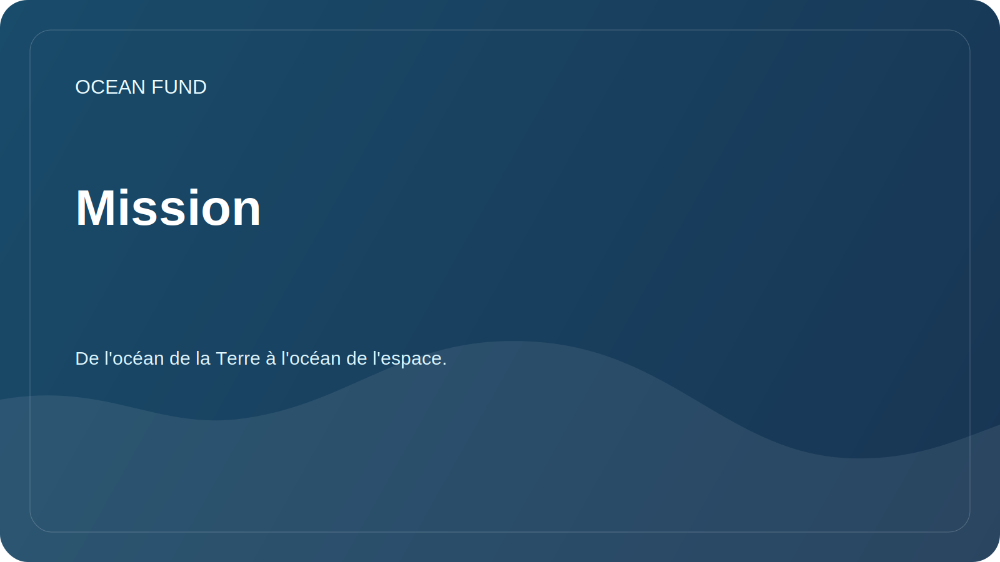

# Mission

Ce document décrit toute la mission du projet. Pour un usage public externe et reproductible, l'ensemble de formulations approuvé est fourni séparément dans [`mission-copy.md`](../../public/fr/mission-copy.md).

## Brièvement

La Fondation Océan crée une infrastructure ouverte de recherche, d'éducation et de technologie qui contribue à améliorer la compréhension de l'océan, à protéger les écosystèmes marins et à engager la société dans une gestion responsable de l'environnement aquatique. La formule est importante pour le projet : de l'océan de la Terre à l'océan de l'espace.

## Pourquoi est-ce nécessaire ?

L’océan régule le climat, soutient la biodiversité et influence les systèmes alimentaires, les transports, la culture, l’économie et la sécurité côtière. Dans le même temps, les données, les connaissances et les initiatives pratiques sont souvent fragmentées : les publications scientifiques existent séparément des programmes éducatifs, les données satellitaires séparément des observations locales et les initiatives publiques séparément de l'agenda des experts.

La Fondation Océan s'efforce de relier ces contours en un système de travail compréhensible. Dans cette logique, l'océan est considéré non seulement comme l'environnement naturel de la Terre, mais aussi comme un pont intellectuel vers les données satellitaires, les observations spatiales et l'image de l'espace comme prochain océan d'exploration.

## Objectifs des missions

| Tâche | Signification pratique |
| --- | --- |
| Recherche | Recueillir des questions, des sources de données et des orientations analytiques sur l'océan |
| Échelles de liens | Montrez comment l'océan terrestre est connecté à l'observation par satellite, aux données spatiales et à la réflexion sur l'horizon. |
| Expliquer | Rendre les sujets complexes compréhensibles pour la société, les médias, les musées et les plateformes éducatives |
| Unir | Aider les scientifiques, les développeurs, les bénévoles et les partenaires à trouver des projets communs |
| Vérifier | Séparer les faits prouvés des hypothèses, des ébauches et des plans |
| Développer les infrastructures | Créer des catalogues de données ouvertes, du matériel pédagogique et des modèles de conception |

## Principes

- L’exactitude scientifique est plus importante que les déclarations grandioses.
- La compréhension internationale est plus importante que le jargon national.
- Les données ouvertes et la reproductibilité valent plus que les promesses de présentations fermées.
- L’océan de la Terre et l’océan de l’espace sont liés par la science, les données, l’éducation et l’imagination.
- Les partenariats ne sont décrits qu'après confirmation.
- Tout matériel public doit être utile à un scientifique, un développeur, un bénévole ou un organisateur d'événement.

## Statut actuel

La Fondation constitue un siège public du projet GitHub : une structure de connaissances, des premières orientations de recherche, une carte de données, des modèles de communication avec les partenaires et une feuille de route de développement.
