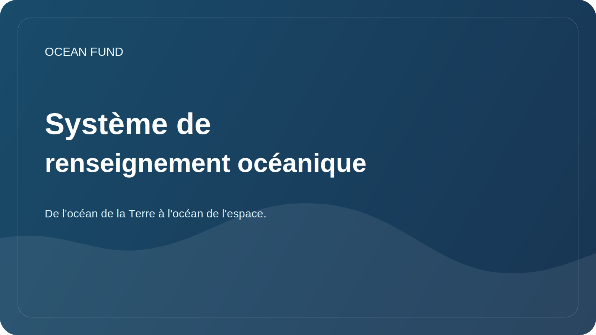

# Système de renseignement océanique

Le document présente un protocole de travail pour une exploration approfondie du sujet océanique. L’océan fait référence non seulement aux mers de la Terre, mais aussi à une classe plus large de « mondes océaniques » : les satellites glacés, les planètes aquatiques, l’environnement spatial en tant qu’océan de navigation, de données et de vie.

## Cible

Construire un système de recherche reproductible qui aide la fondation :

- aborder rapidement de nouveaux sujets océaniques ;
- distinguer les faits vérifiés des hypothèses et des déclarations belles mais non étayées ;
- trouver des données, des partenaires, des événements, des subventions et des événements publics ;
- préparer du matériel pour le site Web, des présentations, des applications, des conférences et des tâches GitHub ;
- relier l'océan terrestre à une perspective cosmique : télédétection, astrobiologie, mondes océaniques, habitabilité planétaire.

## Couches de recherche

| Couche | Ce que nous étudions | Type de résultat |
| --- | --- | --- |
| Science | Écosystèmes, climat, chimie, bathymétrie, astrobiologie | aperçu, glossaire, carte de questions |
| Données | Ensembles de données, API, licences, métadonnées, qualité | fiche de jeu de données, registre, carnet |
| Technologies | Satellites, capteurs, plateformes autonomes, ML, visualisation | brief technique, prototype, problème |
| Établissements | Universités, musées, fondations, programmes des Nations Unies, agences spatiales | brief partenaire, liste des contacts-rôles |
| Publicité | Éducation, expositions, conférences, expéditions, médias | scénario, présentation, publication |
| Stratégie | Risques, éthique, durabilité, financement | feuille de route, journal de décision |

## Cycle de service

1. Formulez la question : que faut-il comprendre exactement et pour quelle décision du fonds.
2. Trouvez des sources primaires : portails de données officiels, programmes scientifiques, publications, documentation API.
3. Divisez les documents en faits, interprétations, hypothèses et idées.
4. Vérifiez la date d'accès, la licence, les restrictions et l'applicabilité pour un usage public.
5. Enregistrez le résultat dans l'un des formats suivants : revue, fiche source, fiche d'ensemble de données, brief du partenaire, problème, résumé de présentation.
6. Transformez le résultat en action : tâche, lettre à un partenaire, visualisation, rapport, prototype, mise à jour du site Web.

## Niveaux de profondeur

| Niveau | Quand utiliser | Que devrait-il arriver |
| --- | --- | --- |
| Reconnaissance rapide | Nouveau sujet ou demande de partenaire | 5 à 10 sources, carte des termes, risques |
| Examen approfondi | Référence de fonds ou matériel public | examen structuré, sources, lacunes |
| Plongée dans les données | Existe-t-il des données ouvertes ou une API ? | cartes d'ensemble de données, exemple de requête, plan de bloc-notes |
| Note stratégique | Il nous faut une solution, une application, un partenariat | conclusions, options d'action, critères de sélection |
| Forfait public | Le matériel s'éteint | formulations vérifiées, liens, restrictions |

## Automation

L’automatisation devrait fonctionner comme un radar de recherche, et non comme un flux de bruit.

Contours réguliers recommandés :

| Circuit | Rythme | Que suivre |
| --- | --- | --- |
| Radar de données océaniques | quotidiennement ou 3 fois par semaine | Copernicus Marine, OBIS, GEBCO, EMODnet, NOAA, Argo, NASA Ocean Color |
| Radar des mondes océaniques | hebdomadaire | NASA, ESA, astrobiologie, Europa Clipper, Encelade, Titan, habitabilité planétaire |
| Radar partenaire | hebdomadaire | universités, musées, fondations, conférences, Décennie de l'Océan |
| Radar des subventions et des événements | hebdomadaire | subventions, appels à propositions, conférences, expositions |
| Hygiène du dépôt | hebdomadaire | liens obsolètes, questions ouvertes, documents avec le statut `needs verification` |

Format du résultat de l'automatisation :

- date et période de surveillance;
- nouvelles sources ou changements ;
- pourquoi c'est important pour le fonds ;
- actions proposées ;
- niveau de confiance;
- références et date d'accès;
- où ajouter le résultat dans le référentiel.

## Sources radar de base

| Source | Rôle |
| --- | --- |
| Banque de données marines Copernicus | surveillance physique, biogéochimique et des glaces de l'océan |
| OBIS | données mondiales sur la biodiversité marine |
| GEBCO | bathymétrie et modèles globaux de relief du fond |
| EMODnet | Données maritimes européennes par domaine |
| NOAA/IOS | observations, bouées, données météorologiques et océanographiques |
| Argo | profils de température et de salinité des océans |
| Couleur de l'océan de la NASA / PACE | données satellitaires sur l'océan, l'atmosphère et la couleur de l'océan |
| Une décennie pour les océans | cadre international de partenariats et de sciences océaniques |
| Mondes océaniques de la NASA / Astrobiologie | contexte cosmique des océans et recherche d’habitabilité |

## Comment apprendre au Codex à travailler dans ce projet

Pour chaque nouvelle commande il est utile de paramétrer :

- thème : l'océan terrestre, l'océan cosmique ou le pont entre eux ;
- artefact souhaité : revue, tableau, présentation, problème, fiche d'ensemble de données, lettre, prototype ;
- profondeur : reconnaissance rapide, examen approfondi, plongée dans les données, briefing stratégique, dossier public ;
- langue : russe, anglais ou bilingue ;
- statut : projet, pour décision interne, matériel préparé publiquement ;
- restrictions : sources, région, date, format, audience partenaire.

S'il n'y a aucun paramètre, le Codex devrait être par défaut :

- commencer par les sources primaires et les données officielles ;
- faites un petit plan avant le grand travail ;
- stocker les résultats vérifiés dans `docs/`, `research/`, `data/` ou `project-management/` ;
- ne présentez pas les partenariats, subventions et découvertes scientifiques non confirmés comme des faits ;
- marquez où un contrôle expert est nécessaire.

## Forfaits de recherche à venir

| Sac en plastique | Signification | Premier résultat |
| --- | --- | --- |
| Ligne de base océanique | Récupérez rapidement les bases scientifiques du fonds | carte d'itinéraire et 30 sources clés |
| Atlas de données | Transformez les sources de données en un registre fonctionnel | Plan de 10 cartes et carnets de données |
| Pont des mondes océaniques | Relier l'océanologie, l'espace et l'astrobiologie | critique "La Terre en tant que monde océanique" |
| Récit public | Formuler un langage public fort pour la fondation | résumés pour le site Web et la présentation |
| Carte des partenaires | Trouver de véritables points d’entrée dans la coopération | liste des organisations et formats de contact |

## Discipline indicatrice

Pour la fondation, l’index n’est pas un fichier secondaire, mais un moyen de maintenir le sujet en vie.

Le minimum qui doit être maintenu à tout moment est :

- registre des index et atlas;
- site summary и publication queues;
- manuel d'engagement du référentiel ;
- connexion entre la couche d’index et la couche de problèmes.
