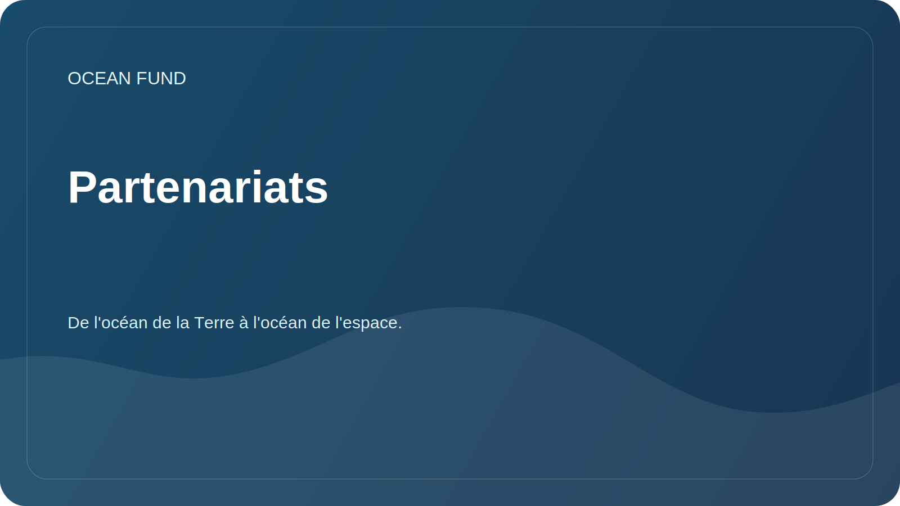

# Partenariats

La Fondation Océan est ouverte à la collaboration avec des organisations qui travaillent sur l'océan, le climat, la biodiversité, l'éducation, les programmes muséaux, les données et la communication scientifique.

## Partenaires possibles

| Type d'organisation | Format possible |
| --- | --- |
| Université | Projets de recherche, stages étudiants, séminaires ouverts |
| Centres scientifiques | Revues collaboratives, méthodologies, catalogues de données |
| Musées et lieux d'exposition | Programmes éducatifs, visualisations, conférences publiques |
| Fondation | Soutenir la recherche, l’éducation et les infrastructures ouvertes |
| Conférences | Rapport, panel, stand, événements parallèles |
| Développeurs et communautés open source | Outils d’analyse, de visualisation et de catalogage des données |

## Que devrait contenir une offre de partenariat

- une brève description de l'organisation;
- thème de la coopération;
- contribution attendue de chaque partie ;
- résultat public ;
- le moment et le format de la communication ;
- restrictions en matière de données, de licence et de publicité.

## Ce que nous ne déclarons pas encore

- mémorandum non confirmé ;
- indicateurs numériques sans source ;
- financement sans information publique approuvée ;
- statut d'un projet international sans participants confirmés.

Les modèles de communication se trouvent dans [`outreach/`](../../outreach/).

## Cartes d'affiliation fonctionnelles

- [`outreach/collaboration-models.md`](../../outreach/collaboration-models.md) - modèles de coopération : mémoire de recherche, sprint de données, conférence, programme de musée, science citoyenne, pont entre les mondes océaniques.
- [`outreach/ocean-organization-atlas.md`](../../outreach/ocean-organization-atlas.md) - un atlas vivant des organisations : structures internationales, réseaux scientifiques, ONG, fondations, technologies océaniques, économie bleue, musées, espace.
