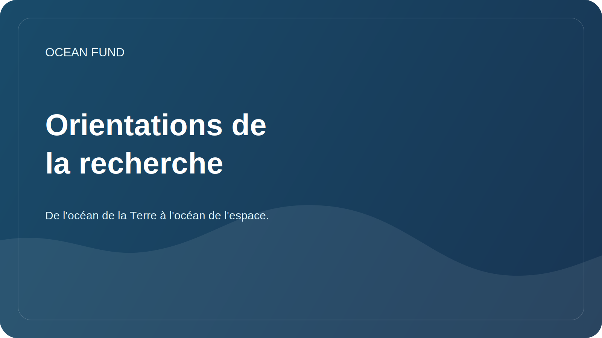

# Orientations de la recherche

Ce document relie la mission de la fondation à des questions de recherche pratiques. L'une des principales motivations publiques du projet : de l'océan de la Terre à l'océan de l'espace.

## Principales orientations

| Direction | Question clé | Premiers résultats |
| --- | --- | --- |
| Biodiversité océanique | Comment décrire l’état des écosystèmes marins à partir de données ouvertes ? | Revue des sources, carte des espèces, liste des indicateurs |
| Océan et climat | Comment les données océaniques contribuent-elles à expliquer le changement climatique ? | Aperçu des variables, sources et visualisations |
| Pollution marine | Quelles données ouvertes permettent de suivre la pollution et les impacts humains ? | Matrice des types et sources de pollution |
| Infrastructure de données océaniques | Comment rendre les données accessibles aux chercheurs, aux développeurs et à la société ? | Registre des ensembles de données, blocs-notes, règles de métadonnées |
| Économie bleue | Comment discuter d’une économie maritime durable sans faire de promesses sans fondement ? | Termes, cas, critères de durabilité |
| Océans et espace | Comment connecter l'océan terrestre, les données satellitaires, les mondes océaniques et l'astrobiologie ? | Revue "La Terre comme monde océanique", carte source NASA/ESA/NOAA/Copernicus, récit "de l'océan de la Terre à l'océan de l'espace" |

## Système d'exploitation de recherche

Pour une étude approfondie et régulière du sujet, le protocole de travail [`ocean-intelligence-system.md`](ocean-intelligence-system.md) est utilisé. Il décrit les niveaux de profondeur, l'automatisation de la surveillance, les formats de résultats et la manière dont le Codex traite les sujets liés aux océans.

## Exigences relatives au matériel de recherche

- faire la distinction entre fait, hypothèse et plan ;
- indiquer les sources et la date d'accès ;
- éviter les déclarations politiques et commerciales sans soutien ;
- ne publiez pas d’informations sensibles ou personnelles ;
- écrire de manière à ce que le matériel puisse être lu par un partenaire international.
