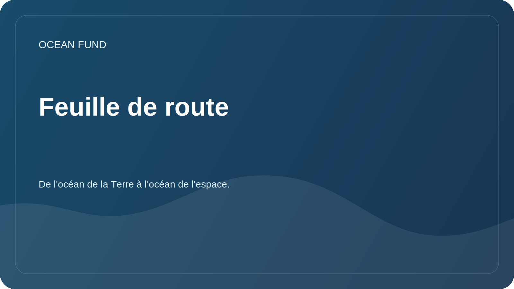

# Feuille de route

La feuille de route définit les prochaines étapes pratiques. Il ne promet pas de résultats tout faits, mais aide à coordonner les tâches ouvertes de la fondation.

## Étape 1. Base publique

| Tâche | Statut | Résultat |
| --- | --- | --- |
| Créer une structure de référentiel GitHub | en cours | README, documents, recherche, données, sensibilisation, gestion de projet |
| Séparer les documents publics des documents internes | en cours | Règles de sécurité et d'inspection |
| Préparer les problèmes et les modèles de relations publiques | en cours | Authentification unique pour les tâches |
| Décrire la mission et les orientations | en cours | Documents pour les partenaires et les participants |

## Étape 2 : Recherche et données

- Créez un registre principal de sources de données ouvertes.
- Décrire les questions de recherche sur la biodiversité, le climat, la pollution et les infrastructures de données.
- Préparez le premier notebook jouable sans données privées.
- Définir des règles de citation des sources et des licences.

## Étape 3 : Partenariats et événements

- Préparez une liste d’organisations cibles.
- Décrire les formats de collaboration pour les universités, les musées, les conférences et les fondations.
- Créez les premières lettres et scripts de communication.
- Préparer des versions courtes de présentations pour les partenaires et les événements.

## Étape 4. Présentation publique

- Configurez les discussions GitHub.
- Préparez les pages GitHub comme vitrine de documentation.
- Ajoutez des sujets et une description du référentiel.
- Faites la première diffusion publique après avoir vérifié les documents.

## Contrôle de qualité

- Chaque déclaration concernant un partenariat, des données ou l'état d'un projet doit avoir une source.
- Tous les brouillons sont marqués comme brouillons ou doivent être vérifiés.
- Les données contenant des informations personnelles, financières ou sensibles ne sont pas publiées.
