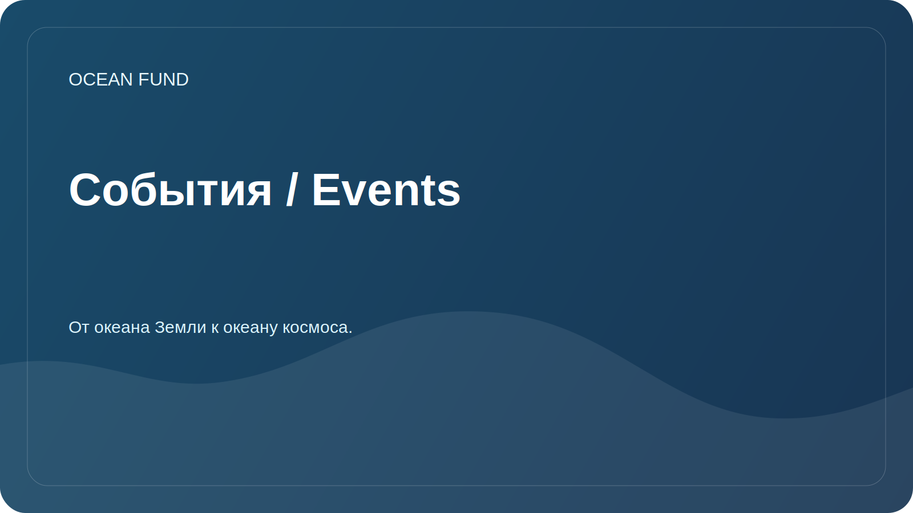

# События / Events

Раздел помогает готовить участие фонда в конференциях, выставках, музейных программах и публичных дискуссиях.

## Форматы участия

| Формат | Для чего подходит |
| --- | --- |
| Доклад | Представить миссию, исследовательские направления и открытые данные |
| Панельная дискуссия | Обсудить океан, климат, данные, образование и межсекторные партнерства |
| Стенд | Показать карты данных, визуализации, образовательные материалы |
| Workshop | Совместно разобрать источник данных или исследовательский вопрос |
| Партнерская встреча | Согласовать будущую совместную активность |

## Карточка события

При добавлении события указывайте:

- название;
- город/страна или online;
- даты;
- организатор;
- тематика;
- ссылка;
- дедлайн подачи заявки;
- возможный формат участия фонда;
- статус: `watching`, `applying`, `submitted`, `accepted`, `declined`, `completed`.

## Ближайшие задачи

- Составить список релевантных океанических, климатических и научно-коммуникационных событий.
- Подготовить универсальную заявку на конференцию.
- Сформировать короткую презентацию фонда.

## Связанные публичные артефакты

- [`../public/conference-exhibition-one-pager.md`](../public/conference-exhibition-one-pager.md)
- [`../public/event-application-pack.md`](../public/event-application-pack.md)
- [`../public/indexes-and-publications-one-pager.md`](../public/indexes-and-publications-one-pager.md)
