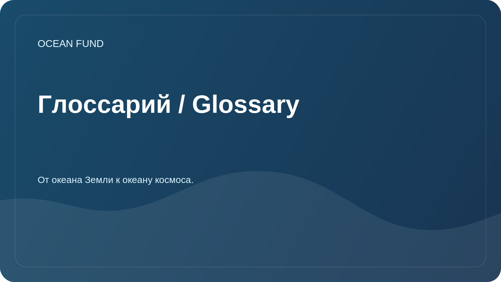

# Глоссарий / Glossary

Рабочий глоссарий помогает участникам использовать единые термины.

| Термин | Значение |
| --- | --- |
| Батиметрия | Измерение и описание рельефа дна водоемов и океана |
| Биоразнообразие | Разнообразие видов, генов и экосистем |
| Blue economy | Экономическая деятельность, связанная с океаном и водными ресурсами, при условии устойчивого подхода |
| Citizen science | Участие общества и волонтеров в сборе, проверке или интерпретации научных данных |
| Data infrastructure | Набор правил, инструментов, форматов и процессов для надежной работы с данными |
| Marine pollution | Загрязнение морской среды пластиком, химическими веществами, шумом, нефтепродуктами и другими воздействиями |
| Ocean literacy | Понимание роли океана в жизни человека и влияния человека на океан |
| Open data | Данные, доступные для использования при соблюдении лицензий и правил цитирования |
| Remote sensing | Дистанционное зондирование Земли, включая спутниковые наблюдения |
| Reproducibility | Возможность повторить анализ данных по описанному методу |

## Правило добавления терминов

Новый термин должен иметь короткое определение, контекст использования и при необходимости ссылку на источник.
