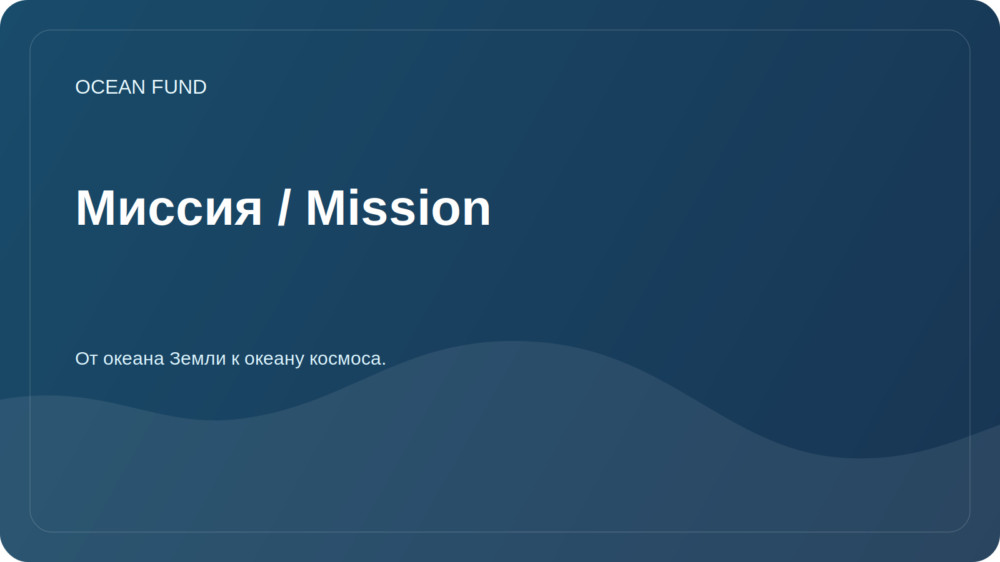

# Миссия / Mission

Этот документ описывает миссию проекта целиком. Для внешнего и повторяемого публичного использования утвержденный набор формулировок вынесен отдельно в [public/mission-copy.md](../public/mission-copy.md).

## Кратко

Фонд «Океан» создает открытую исследовательскую, образовательную и технологическую инфраструктуру, которая помогает лучше понимать океан, защищать морские экосистемы и вовлекать общество в ответственное отношение к водной среде. Для проекта важна формула: от океана Земли к океану космоса.

## Зачем это нужно

Океан регулирует климат, поддерживает биоразнообразие, влияет на продовольственные системы, транспорт, культуру, экономику и безопасность прибрежных территорий. При этом данные, знания и практические инициативы часто разрознены: научные публикации существуют отдельно от образовательных программ, спутниковые данные отдельно от локальных наблюдений, а общественные инициативы отдельно от экспертной повестки.

Фонд «Океан» стремится соединять эти контуры в понятную рабочую систему. В этой логике океан рассматривается не только как природная среда Земли, но и как интеллектуальный мост к спутниковым данным, космическим наблюдениям и образу космоса как следующего океана исследования.

## Миссионные задачи

| Задача | Практический смысл |
| --- | --- |
| Исследовать | Собирать вопросы, источники данных и аналитические направления по океану |
| Связывать масштабы | Показывать, как океан Земли связан со спутниковым наблюдением, космическими данными и horizon thinking |
| Объяснять | Делать сложные темы понятными для общества, медиа, музеев и образовательных площадок |
| Соединять | Помогать ученым, разработчикам, волонтерам и партнерам находить общие проекты |
| Проверять | Отделять подтвержденные факты от гипотез, черновиков и планов |
| Развивать инфраструктуру | Создавать открытые каталоги данных, методические материалы и проектные шаблоны |

## Принципы

- Научная аккуратность важнее громких заявлений.
- Международная понятность важнее внутреннего жаргона.
- Открытые данные и воспроизводимость ценнее закрытых презентационных обещаний.
- Океан Земли и океан космоса соединяются через науку, данные, образование и воображение.
- Партнерства описываются только после подтверждения.
- Любой публичный материал должен быть полезен ученому, разработчику, волонтеру или организатору события.

## Текущий статус

Фонд формирует публичный GitHub-штаб проекта: структуру знаний, первые исследовательские направления, карту данных, шаблоны партнерской коммуникации и дорожную карту развития.
