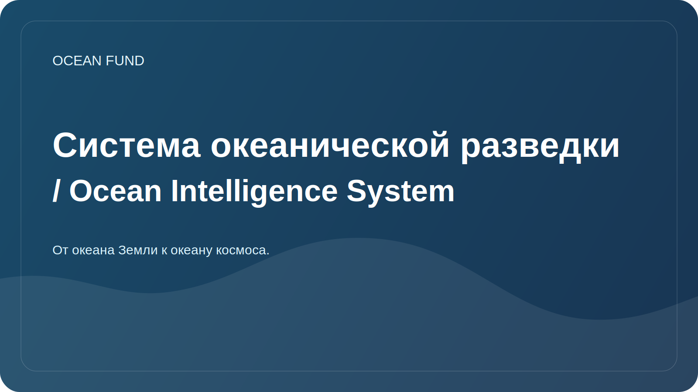

# Система океанической разведки / Ocean Intelligence System

Документ задает рабочий протокол для глубокого исследования темы океана. Под океаном понимаются не только моря Земли, но и более широкий класс "океанических миров": ледяные спутники, водные планеты, космическая среда как океан навигации, данных и жизни.

## Цель

Собрать воспроизводимую исследовательскую систему, которая помогает фонду:

- быстро входить в новые океанические темы;
- отличать проверенные факты от гипотез и красивых, но неподтвержденных заявлений;
- находить данные, партнеров, события, гранты и публичные поводы;
- готовить материалы для сайта, презентаций, заявок, лекций и GitHub-задач;
- связывать океан Земли с космической перспективой: remote sensing, astrobiology, ocean worlds, planetary habitability.

## Исследовательские слои

| Слой | Что изучаем | Тип результата |
| --- | --- | --- |
| Наука | Экосистемы, климат, химия, батиметрия, астробиология | обзор, глоссарий, карта вопросов |
| Данные | Наборы данных, API, лицензии, метаданные, качество | dataset card, реестр, notebook |
| Технологии | Спутники, сенсоры, автономные платформы, ML, визуализация | технический brief, прототип, issue |
| Институции | Университеты, музеи, фонды, программы ООН, космические агентства | partner brief, список контактов-ролей |
| Публичность | Образование, выставки, лекции, экспедиции, медиа | сценарий, презентация, публикация |
| Стратегия | Риски, этика, устойчивость, финансирование | дорожная карта, decision log |

## Рабочий цикл

1. Сформулировать вопрос: что именно надо понять и для какого решения фонда.
2. Найти первичные источники: официальные порталы данных, научные программы, публикации, документацию API.
3. Разделить материалы на факты, интерпретации, гипотезы и идеи.
4. Проверить дату доступа, лицензию, ограничения и применимость для публичного использования.
5. Сохранить результат в одном из форматов: обзор, карточка источника, dataset card, partner brief, issue, презентационный тезис.
6. Превратить результат в действие: задача, письмо партнеру, визуализация, доклад, прототип, обновление сайта.

## Уровни глубины

| Уровень | Когда использовать | Что должно получиться |
| --- | --- | --- |
| Быстрая разведка | Новая тема или запрос партнера | 5-10 источников, карта терминов, риски |
| Глубокий обзор | Направление для фонда или публичный материал | структурированный обзор, источники, пробелы |
| Data dive | Есть открытые данные или API | dataset cards, пример запроса, notebook-план |
| Strategic brief | Нужно решение, заявка, партнерство | выводы, варианты действий, критерии выбора |
| Public package | Материал идет наружу | проверенные формулировки, ссылки, ограничения |

## Автоматизация

Автоматизация должна работать как исследовательский радар, а не как поток шума.

Рекомендуемые регулярные контуры:

| Контур | Ритм | Что отслеживать |
| --- | --- | --- |
| Ocean data radar | ежедневно или 3 раза в неделю | Copernicus Marine, OBIS, GEBCO, EMODnet, NOAA, Argo, NASA Ocean Color |
| Ocean worlds radar | еженедельно | NASA, ESA, astrobiology, Europa Clipper, Enceladus, Titan, planetary habitability |
| Partner radar | еженедельно | университеты, музеи, фонды, конференции, Ocean Decade |
| Grant and event radar | еженедельно | гранты, calls for proposals, конференции, выставки |
| Repository hygiene | еженедельно | устаревшие ссылки, незакрытые вопросы, материалы со статусом `needs verification` |

Формат результата автоматизации:

- дата и период мониторинга;
- новые источники или изменения;
- почему это важно для фонда;
- предлагаемые действия;
- уровень уверенности;
- ссылки и дата доступа;
- куда добавить результат в репозитории.

## Базовые источники для радара

| Источник | Роль |
| --- | --- |
| Copernicus Marine Data Store | физический, биогеохимический и ледовый мониторинг океана |
| OBIS | глобальные данные о морском биоразнообразии |
| GEBCO | батиметрия и глобальные модели рельефа дна |
| EMODnet | европейские морские данные по тематическим направлениям |
| NOAA / IOOS | наблюдения, буи, погодные и океанографические данные |
| Argo | профили температуры и солености океана |
| NASA Ocean Color / PACE | спутниковые данные об океане, атмосфере и цвете океана |
| UN Ocean Decade | международная рамка науки об океане и партнерств |
| NASA Ocean Worlds / Astrobiology | космический контекст океанов и поиск обитаемости |

## Как учить Codex работать в этом проекте

Для каждого нового поручения полезно задавать:

- тему: океан Земли, космический океан или мост между ними;
- желаемый артефакт: обзор, таблица, презентация, issue, dataset card, письмо, прототип;
- глубину: быстрая разведка, глубокий обзор, data dive, strategic brief, public package;
- язык: русский, английский или двуязычно;
- статус: черновик, для внутреннего решения, публично готовый материал;
- ограничения: источники, регион, дата, формат, партнерская аудитория.

Если параметров нет, Codex по умолчанию должен:

- начинать с первичных источников и официальных данных;
- делать короткий план перед большой работой;
- сохранять проверяемые результаты в `docs/`, `research/`, `data/` или `project-management/`;
- не выдавать неподтвержденные партнерства, гранты и научные выводы за факт;
- отмечать, где нужна проверка экспертом.

## Ближайшие исследовательские пакеты

| Пакет | Смысл | Первый результат |
| --- | --- | --- |
| Ocean baseline | Быстро собрать научную основу фонда | карта направлений и 30 ключевых источников |
| Data atlas | Превратить источники данных в рабочий реестр | 10 dataset cards и план notebooks |
| Ocean worlds bridge | Связать океанологию, космос и астробиологию | обзор "Земля как океанический мир" |
| Public narrative | Сформулировать сильный публичный язык фонда | тезисы для сайта и презентации |
| Partner map | Найти реальные точки входа в сотрудничество | список организаций и форматов контакта |

## Индексная дисциплина

Для фонда индекс - это не вторичный файл, а способ держать тему живой.

Минимум, который должен поддерживаться постоянно:

- реестр индексов и атласов;
- site summary и publication queues;
- repository engagement playbook;
- связка между index layer и issue layer.
