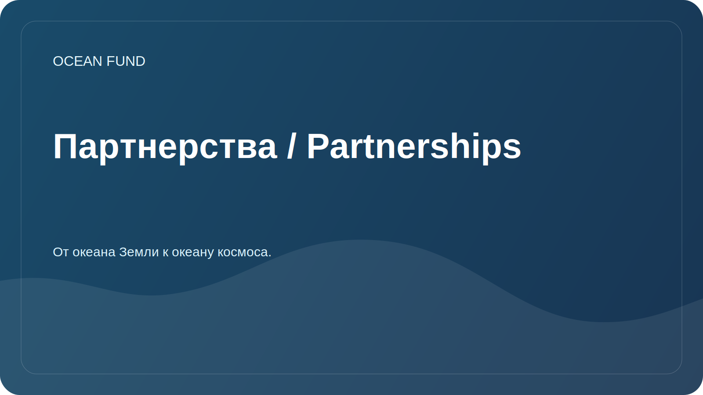

# Партнерства / Partnerships

Фонд «Океан» открыт к сотрудничеству с организациями, которые работают с океаном, климатом, биоразнообразием, образованием, музейными программами, данными и научной коммуникацией.

## Возможные партнеры

| Тип организации | Возможный формат |
| --- | --- |
| Университеты | Исследовательские проекты, студенческие практики, открытые семинары |
| Научные центры | Совместные обзоры, методологии, каталоги данных |
| Музеи и выставочные площадки | Образовательные программы, визуализации, публичные лекции |
| Фонды | Поддержка исследований, просвещения и открытой инфраструктуры |
| Конференции | Доклады, панели, стенды, side-events |
| Разработчики и open-source сообщества | Инструменты анализа, визуализации и каталогизации данных |

## Что должно быть в партнерском предложении

- краткое описание организации;
- тема сотрудничества;
- ожидаемый вклад каждой стороны;
- публичный результат;
- сроки и формат коммуникации;
- ограничения по данным, лицензиям и публичности.

## Что пока не заявляем

- неподтвержденные меморандумы;
- численные показатели без источника;
- финансирование без утвержденной публичной информации;
- статус международного проекта без подтвержденных участников.

Шаблоны коммуникации находятся в [`outreach/`](../outreach/).

## Рабочие партнерские карты

- [`outreach/collaboration-models.md`](../outreach/collaboration-models.md) — модели сотрудничества: research brief, data sprint, лекция, музейная программа, citizen science, ocean worlds bridge.
- [`outreach/ocean-organization-atlas.md`](../outreach/ocean-organization-atlas.md) — живой атлас организаций: международные структуры, научные сети, НКО, фонды, ocean tech, blue economy, музеи, космос.
