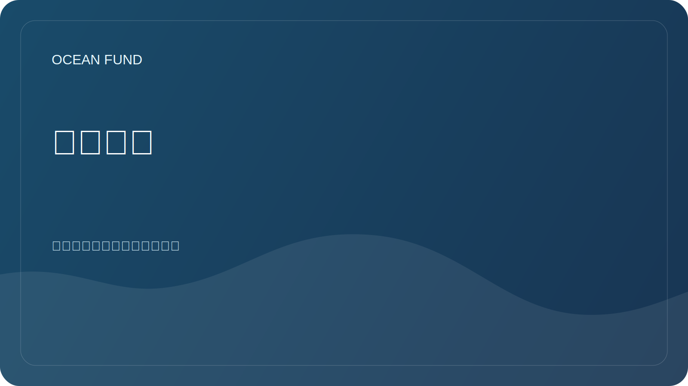

# 数据来源

海洋基金会探索可用于研究、教育、可视化和社区项目的开放数据源。

## 优先方向

| 来源 | 潜在价值 | 要检查什么 |
| --- | --- | --- |
| 哥白尼海洋 | 海洋学数据、模型、监测 | 许可证、API、空间和时间覆盖范围 |
| 奥比斯 | 海洋生物多样性数据 | 分类、帖子质量、引用 |
| 吉布科 | 测深网格和底部地形 | 许可、使用限制 |
| EMOD网 | 有关多个主题的欧洲海事数据 | 可访问性、元数据、标准 |
| 美国国家海洋和大气管理局/IOS | 观测、浮标、天气和海洋数据 | API、可更新性、区域性 |
| 深探网 | 带注释的水下图像 | 许可证、标签质量、机器学习的适用性 |
| 海洋十年 | 计划、项目、合作框架 | 倡议和参与机会的现状 |
| 卫星和测深数据 | 表面温度、叶绿素、冰、深度 | 来源、处理、错误 |

## 最小源卡

- 姓名;
- 运营商组织；
- 关联;
- 数据类型；
- 地理覆盖范围；
- 临时承保；
- 执照;
- 访问方法；
- 研究用途示例；
- 日期检查。

详细的工作寄存器位于 [`datasets-register.md`](../../data/datasets-register.md)。
