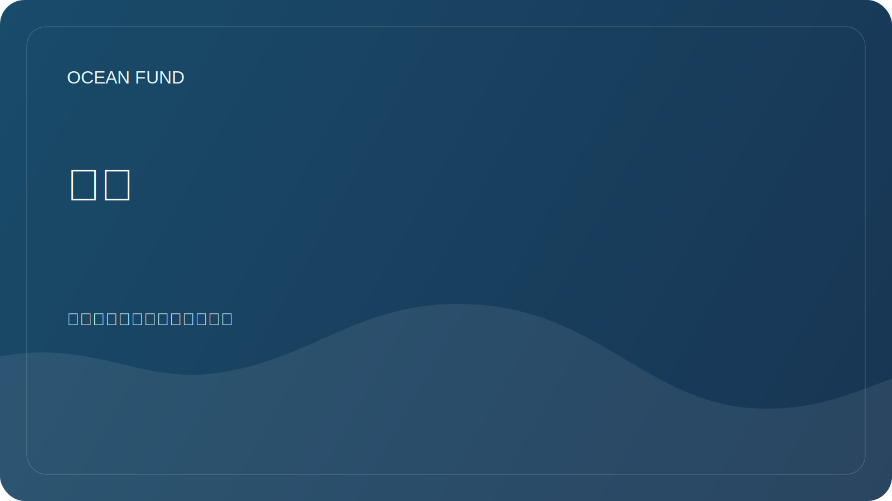

# 活动

该部分帮助准备基金会参与会议、展览、博物馆项目和公众讨论。

## 参与形式

| 格式 | 它适合什么用途？ |
| --- | --- |
| 报告 | 介绍使命、研究方向和开放数据 |
| 小组讨论 | 讨论海洋、气候、数据、教育和跨部门伙伴关系 |
| 站立 | 显示数据地图、可视化、教育材料 |
| 车间 | 协作探索数据源或研究问题 |
| 合作伙伴会议 | 就未来的联合活动达成一致 |

## 活动卡

添加事件时，请指定：

- 姓名;
- 城市/国家或在线；
- 日期；
- 组织者;
- 主题;
- 关联;
- 申请截止日期；
- 基金参与的可能形式；
- 状态：`watching`、`applying`、`submitted`、`accepted`、`declined`、`completed`。

## 即将到来的任务

- 编制相关海洋、气候和科学传播事件的清单。
- 为会议准备一份通用申请。
- 创建基金的简短介绍。

## 相关公共工件

- [`conference-exhibition-one-pager.md`](../../public/zh/conference-exhibition-one-pager.md)
- [`event-application-pack.md`](../../public/zh/event-application-pack.md)
- [`indexes-and-publications-one-pager.md`](../../public/zh/indexes-and-publications-one-pager.md)
