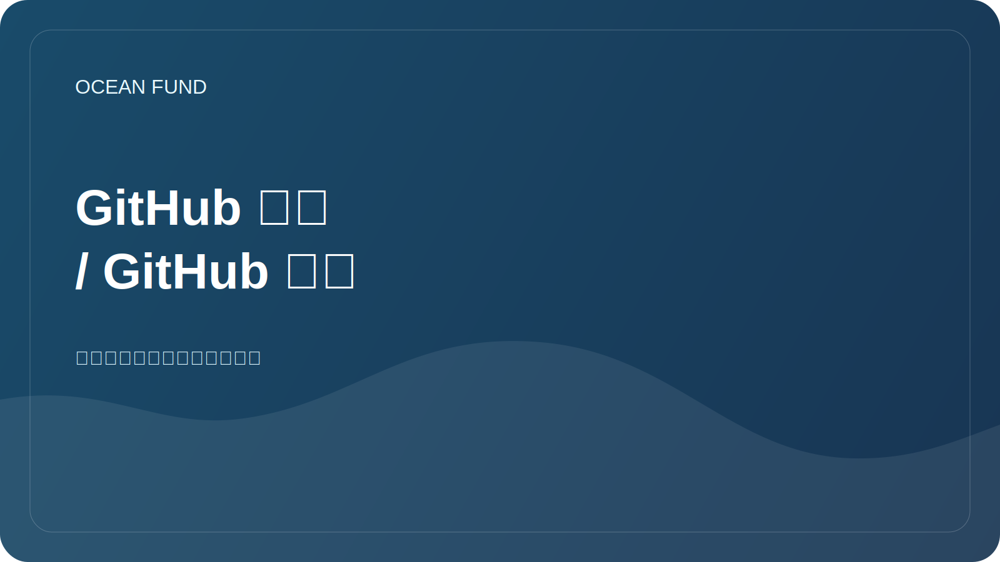

# GitHub 展示 / GitHub 设计

需要这份文件才能使海洋基金作为一项生动、清晰和严肃的倡议出现在 GitHub 上，而不是作为内部草案的集合。

## 什么是什么

### 1.GitHub简介

这是用户或组织页面。这是人们首先评估你是谁、你做什么以及是否值得进一步阅读的地方。

您需要填写：

- 名称：`Ocean Fund` 或批准的正式名称；
- 一句话的简短描述；
- 头像或标志；
- 地点;
- 网站;
- 社会联系；
- 固定存储库。

### 2. 存储库主页

这是项目根目录下的 `README.md` 。它必须回答四个问题：

- 这是什么；
- 为什么它存在？
- 已经存在的东西；
- 单击下一步的位置。

### 3. GitHub Pages 或外部店面

对于那些已经在常规自述文件中感到局促的人来说，这是一个单独的公共页面。对于 Ocean Fund，初创店面必须位于 `public/` 或单独的外部站点上。

### 4. 强制公共层

海洋基金有两个必需的要素，没有这两个要素，公开展示就被认为是不完整的：

- 面向合作伙伴的入口页面；
- 批准的公共任务副本。

在存储库中，这意味着外部导航必须至少导致：

- [`partners.md`](../../public/zh/partners.md)
- [`partner-one-pager.md`](../../public/zh/partner-one-pager.md)
- [`mission-copy.md`](../../public/zh/mission-copy.md)

对于面向活动的工作，还建议保持在附近：

- [`conference-exhibition-one-pager.md`](../../public/zh/conference-exhibition-one-pager.md)
- [`event-application-pack.md`](../../public/zh/event-application-pack.md)

## 在 GitHub 中完成的最低要求

### 轮廓

- 带有可读标志的头像；
- 俄语或英语的简短个人简介；
- 链接到主存储库；
- 3-6 个固定存储库；
- 简介自述文件，包含使命、方向和参与方式。

配置文件模板：[`github-profile-readme.md`](../../templates/github-profile-readme.md)

### 存储库

- 存储库的简短描述；
- 网站网址；
- 主题；
- 社交预览图像；
- 包括问题和讨论；
- 清除自述文件；
- 面向合作伙伴的展示；
- 合作伙伴单页机；
- 会议/展览单页机；
- 活动申请包；
- 公共任务副本；
- 首先开放的问题。

## 推荐的存储库描述

俄语版本：

> 该基金会的海洋、气候、生物多样性、海洋数据、教育和国际伙伴关系的开放数据库。

英文版：

> 开放海洋、气候、生物多样性、海洋数据、教育、人工智能和伙伴关系项目中心。

## 推荐主题

- `ocean`
- `climate`
- `biodiversity`
- `marine-data`
- `open-science`
- `education`
- `ai-for-good`
- `research`
- `nonprofit`
- `ocean-literacy`

## 添加到您的个人资料中的内容

如果个人资料是个人的：

- 主要资金存放处；
- 展示或项目现场；
- 包含数据或笔记本的存储库；
- 包含演示文稿或公共材料的存储库。

如果组织简介：

- 主要公共枢纽；
- 数据集或数据注册表；
- 网站或页面；
- 研究或笔记本；
- 外展或媒体工具包；
- 治理或文档（如果单独提供）。

## 首先公开的问题应该放什么

- 研究：收集 10 个优先海洋和气候主题。
- 数据：设计5个经过验证的开放数据源。
- 外展：为大学和博物馆准备一封简短的信函。
- 品牌：认可名称和描述的英文拼写。
- 网站：将 `public/` 引入单个公共版本。
- 治理：定义公共联系和许可策略。

另请参阅[文档/60-github-issues.md](60-github-issues.md)。

## 社交预览

对于 GitHub，准备一个大小为 `1280x640` 的单独封面很有用。

上面应该写什么：

- 项目名称；
- 简短的使命宣言；
- 2-4个关键字，例如：`Ocean`、`Climate`、`Data`、`Partnerships`。

草稿来源：[ asset/brand/github-social-preview.svg](../../assets/brand/github-social-preview.svg)

## 展示启动程序

1. 使用当前的 `README.md` 发布存储库。
2. 确认所需的公共层：`public/partners.md` 和 `public/mission-copy.md`。
3. 在存储库设置中填写描述、网站、主题和社交预览。
4. 如果您想要公开想法和讨论，请打开讨论。
5. 创建 5-10 个起始问题，以便访问者可以立即看到动态。
6. 为用户或组织准备一份配置文件自述文件。
7. 将存储库固定到您的个人资料中。
8. 如有必要，请连接 GitHub Pages 或 `public/` 中的单独站点。

## 好的结果看起来像这样

一个人打开GitHub，立即明白：

- 这不是一个随机的草案，而是一个正式的开放项目中心；
- 该项目处于早期阶段，但诚实地展示了结构和计划；
- 您已经可以在这里参与：研究、数据帮助、翻译、合作伙伴关系和材料。
