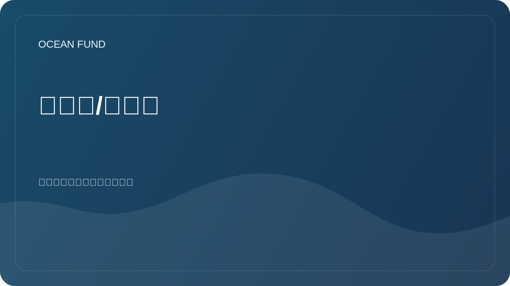

# 术语表/术语表

工作术语表可帮助参与者使用常用术语。

| 学期 | 意义 |
| --- | --- |
| 测深 | 水库和海洋底部地形的测量和描述 |
| 生物多样性 | 物种、基因和生态系统的多样性 |
| 蓝色经济 | 与海洋和水资源相关的经济活动，遵循可持续的方针 |
| 公民科学 | 公众和志愿者参与科学数据的收集、验证或解释 |
| 数据基础设施 | 一组用于可靠地处理数据的规则、工具、格式和流程 |
| 海洋污染 | 塑料、化学品、噪音、石油产品和其他影响造成的海洋污染 |
| 海洋素养 | 了解海洋在人类生活中的作用以及人类对海洋的影响 |
| 开放数据 | 可供使用的数据须遵守许可和引用规则 |
| 遥感 | 地球遥感，包括卫星观测 |
| 再现性 | 使用所描述的方法重复数据分析的可能性 |

## 添加术语的规则

新术语应有简短的定义、使用上下文，如有必要，还应有来源链接。
