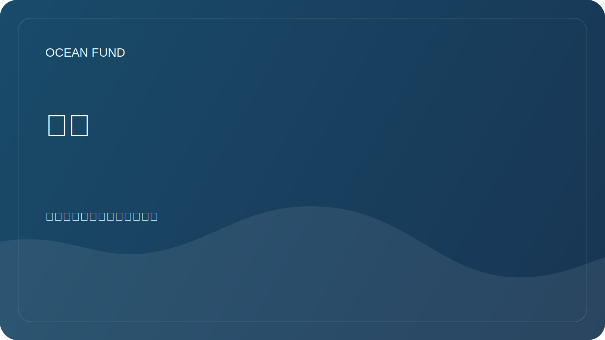

# 管理

本文档描述了基金会如何维护开放存储库并接受更改。

## 角色

| 角色 | 责任 |
| --- | --- |
| 维护者 | 检查结构、安全性、基调以及是否符合基金会的使命 |
| 研究贡献者 | 建议研究问题、评论和来源 |
| 数据贡献者 | 添加数据源、数据集描述和笔记本 |
| 外展贡献者 | 准备合作伙伴关系、活动和交流的材料 |
| 审稿人 | 检查事实、参考资料、许可证和公众适用性 |

## 如何接受变更

1. 可以通过拉取请求提出较小的编辑。
2. 新方向、合作伙伴关系和公告首先在问题中进行讨论。
3. 未经验证的材料的状态为 `needs verification`。
4. 在单独验证之前，不会接受存在个人数据风险的材料。

## 公众准备标准

- 文中仅指海洋基金会；
- 没有私人联系人、代币、财务详细信息和个人文件；
- 明确说明数据来源和外部断言；
- 语气专业、冷静且国际化；
- 对于不存在的结果不做任何承诺。

## 决策日志

关键决策记录在 [`decision-log.md`](../../project-management/decision-log.md) 中。
