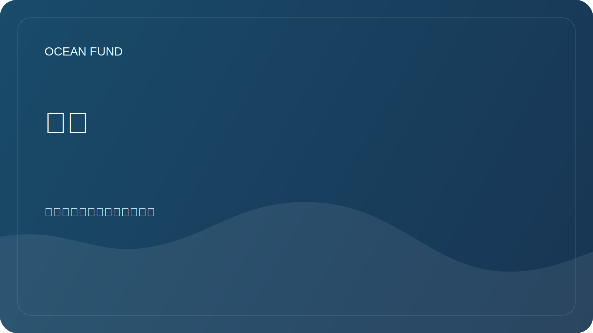

# 使命

本文件描述了该项目的整个使命。对于外部和可重复的公共使用，批准的措辞集单独呈现在 [`mission-copy.md`](../../public/zh/mission-copy.md) 中。

## 简要地

海洋基金会创建开放的研究、教育和技术基础设施，帮助提高对海洋的了解，保护海洋生态系统，并让社会参与到水生环境的负责任的管理中。这个公式对于这个项目很重要：从地球的海洋到太空的海洋。

## 为什么这是必要的？

海洋调节气候，支持生物多样性，并影响粮食系统、交通、文化、经济和沿海安全。与此同时，数据、知识和实践举措往往是支离破碎的：科学出版物与教育计划分开存在，卫星数据与当地观测分开存在，公共举措与专家议程分开存在。

海洋基金会致力于将这些轮廓连接成一个易于理解的工作系统。按照这种逻辑，海洋不仅被视为地球的自然环境，而且还被视为通向卫星数据、太空观测和下一个探索海洋的太空形象的知识桥梁。

## 使命目标

| 任务 | 实际意义 |
| --- | --- |
| 研究 | 收集有关海洋的问题、数据源和分析方向 |
| 链接秤 | 展示地球海洋如何与卫星观测、空间数据和地平线思维联系起来 |
| 解释 | 让社会、媒体、博物馆和教育平台能够理解复杂的主题 |
| 团结 | 帮助科学家、开发人员、志愿者和合作伙伴找到共同的项目 |
| 查看 | 将已证实的事实与假设、草案和计划分开 |
| 发展基础设施 | 创建开放数据目录、教材和设计模板 |

## 原则

- 科学的准确性比浮夸的陈述更重要。
- 国际理解比国内行话更重要。
- 开放的数据和可重复性比封闭的演示承诺更有价值。
- 地球的海洋和太空的海洋通过科学、数据、教育和想象力连接在一起。
- 仅在确认后才描述合作伙伴关系。
- 任何公共材料都应该对科学家、开发人员、志愿者或活动组织者有用。

## 目前状态

基金会正在组建公共GitHub项目总部：知识结构、首要研究方向、数据地图、合作伙伴沟通模板和发展路线图。
