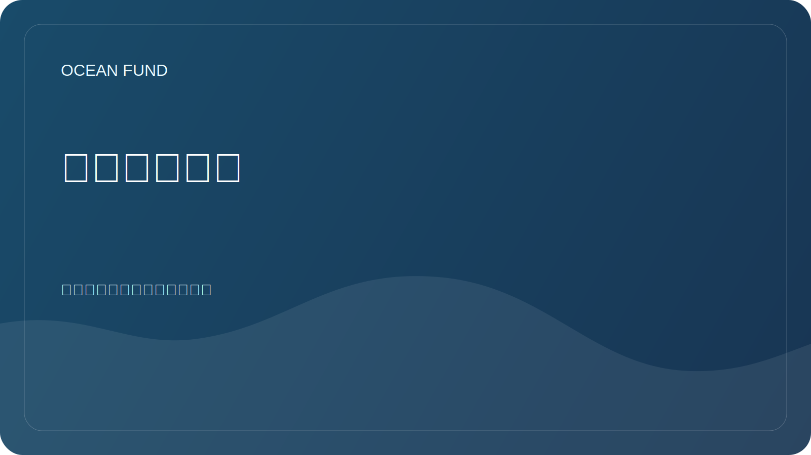

# 海洋智能系统

该文件制定了深入探索海洋主题的工作协议。海洋不仅指地球的海洋，还指更广泛的“海洋世界”：冰冷的卫星、水行星、作为导航、数据和生命海洋的太空环境。

## 目标

建立一个可重复的研究系统，帮助基金会：

- 快速进入新的海洋话题；
- 区分经过验证的事实与假设以及美丽但未经支持的陈述；
- 查找数据、合作伙伴、活动、赠款和公共活动；
- 为网站、演示文稿、应用程序、讲座和 GitHub 任务准备材料；
- 将地球海洋与宇宙视角联系起来：遥感、天体生物学、海洋世界、行星宜居性。

## 研究层

| 层 | 我们研究什么 | 结果类型 |
| --- | --- | --- |
| 科学 | 生态系统、气候、化学、测深、天体生物学 | 概述、术语表、问题卡 |
| 数据 | 数据集、API、许可证、元数据、质量 | 数据集卡、登记册、笔记本 |
| 技术 | 卫星、传感器、自主平台、机器学习、可视化 | 技术简介、原型、问题 |
| 机构 | 大学、博物馆、基金会、联合国项目、航天机构 | 合作伙伴简介、联系人角色列表 |
| 宣传 | 教育、展览、讲座、探险、媒体 | 剧本、演示文稿、出版物 |
| 战略 | 风险、道德、可持续性、融资 | 路线图、决策日志 |

## 工作周期

1. 提出问题：到底需要了解什么以及基金做出什么决定。
2. 查找主要来源：官方数据门户、科学计划、出版物、API 文档。
3. 将材料分为事实、解释、假设和想法。
4. 检查访问日期、许可证、限制和公共使用的适用性。
5. 将结果保存为以下格式之一：评论、源卡、数据集卡、合作伙伴简介、问题、演示摘要。
6. 将结果转化为行动：任务、给合作伙伴的信、可视化、报告、原型、网站更新。

## 深度级别

| 等级 | 何时使用 | 应该发生什么 |
| --- | --- | --- |
| 快速侦察 | 新主题或合作伙伴请求 | 5-10 个来源、术语图、风险 |
| 深入审查 | 基金推荐或公开材料 | 结构化审查、来源、差距 |
| 数据潜水 | 有开放数据或API吗？ | 数据集卡、查询示例、笔记本计划 |
| 战略简报 | 我们需要一个解决方案、一个应用程序、一个合作伙伴关系 | 结论、行动选项、选择标准 |
| 公共套餐 | 材料耗尽 | 经过验证的配方、链接、限制 |

## 自动化

自动化应该像研究雷达一样工作，而不是像噪音流一样。

推荐的常规轮廓：

| 电路 | 韵律 | 追踪什么 |
| --- | --- | --- |
| 海洋数据雷达 | 每天或每周 3 次 | Copernicus Marine、OBIS、GEBCO、EMODnet、NOAA、Argo、NASA 海洋颜色 |
| 海洋世界雷达 | 每周 | 美国宇航局、欧空局、天体生物学、欧罗巴快艇、土卫二、土卫六、行星宜居性 |
| 合作伙伴雷达 | 每周 | 大学、博物馆、基金会、会议、海洋十年 |
| 格兰特和事件雷达 | 每周 | 赠款、征求建议书、会议、展览 |
| 储存库卫生 | 每周 | 过时的链接、未解决的问题、状态为 `needs verification` 的材料 |

自动化结果格式：

- 监测日期和期限；
- 新来源或变化；
- 为什么这对基金很重要；
- 拟议的行动；
- 信心程度；
- 参考文献和访问日期；
- 将结果添加到存储库中的位置。

## 基本雷达源

| 来源 | 角色 |
| --- | --- |
| 哥白尼海洋数据存储 | 海洋物理、生物地球化学和冰监测 |
| 奥比斯 | 全球海洋生物多样性数据 |
| 吉布科 | 测深和全球底部浮雕模型 |
| EMOD网 | 按主题区域划分的欧洲海事数据 |
| 美国国家海洋和大气管理局/IOS | 观测、浮标、天气和海洋学数据 |
| 阿尔戈 | 海洋温度和盐度剖面 |
| NASA 海洋颜色 / PACE | 有关海洋、大气和海洋颜色的卫星数据 |
| 海洋十年 | 国际海洋科学和伙伴关系框架 |
| 美国宇航局海洋世界/天体生物学 | 海洋的宇宙背景和对宜居性的探索 |

## 如何指导 Codex 在该项目中工作

对于每个新订单，设置：

- 主题：地球海洋、宇宙海洋或它们之间的桥梁；
- 所需的工件：评论、表格、演示文稿、问题、数据集卡、信件、原型；
- 深度：快速侦察、深度回顾、数据挖掘、战略简报、公开包；
- 语言：俄语、英语或双语；
- 状态：草案，供内部决定，公开准备的材料；
- 限制：来源、地区、日期、格式、合作伙伴受众。

如果没有参数，Codex 应默认为：

- 从主要来源和官方数据开始；
- 在大工作之前先制定一个小计划；
- 将检查结果存储在 `docs/`、`research/`、`data/` 或 `project-management/` 中；
- 请勿将未经证实的合作伙伴关系、赠款和科学发现视为事实；
- 标记需要专家检查的地方。

## 即将推出的研究包

| 塑料袋 | 意义 | 第一个结果 |
| --- | --- | --- |
| 海洋基线 | 快速收集基金的科学依据 | 方向图和 30 个关键来源 |
| 数据图册 | 将数据源转变为工作注册表 | 10 个数据集卡和笔记本计划 |
| 海洋世界桥 | 连接海洋学、太空和天体生物学 | 评论“地球是一个海洋世界” |
| 公共叙事 | 为基金会制定强有力的公共语言 | 网站和演示文稿的摘要 |
| 合作伙伴地图 | 寻找真正的合作切入点 | 组织和联系方式列表 |

## 指数纪律

对于基金会来说，索引不是辅助文件，而是让主题保持活力的一种方式。

始终必须保持的最低限度是：

- 索引和图册登记册；
- 站点摘要和发布队列；
- 存储库参与手册；
- 索引层和问题层之间的连接。
