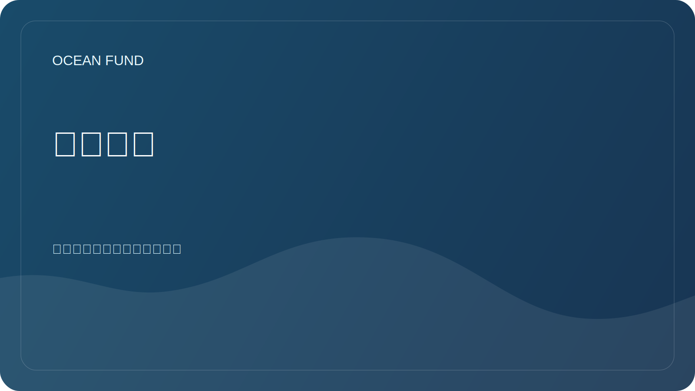

# 合作伙伴

海洋基金会愿意与致力于海洋、气候、生物多样性、教育、博物馆项目、数据和科学传播的组织合作。

## 可能的合作伙伴

| 组织类型 | 可能的格式 |
| --- | --- |
| 大学 | 研究项目、学生实践、公开研讨会 |
| 科学中心 | 协作评审、方法论、数据目录 |
| 博物馆和展览场馆 | 教育项目、可视化、公开讲座 |
| 基础 | 支持研究、教育和开放基础设施 |
| 会议 | 报告、小组讨论、展位、会外活动 |
| 开发者和开源社区 | 数据分析、可视化和编目工具 |

## 合作伙伴报价中应包含哪些内容

- 该组织的简要描述；
- 合作主题；
- 各方的预期贡献；
- 公开结果；
- 沟通的时间和格式；
- 数据、许可和宣传限制。

## 我们尚未宣布的内容

- 未经确认的备忘录；
- 无来源的数字指标；
- 未经批准的公开信息进行融资；
- 未确认参与者的国际项目的状态。

沟通模板位于 [`outreach/`](../../outreach/)。

## 工作附属卡

- [`collaboration-models.md`](../../outreach/collaboration-models.md) - 合作模式：研究简介、数据冲刺、讲座、博物馆项目、公民科学、海洋世界桥梁。
- [`ocean-organization-atlas.md`](../../outreach/ocean-organization-atlas.md) - 活的组织地图集：国际机构、科研网络、非营利组织、基金会、海洋技术、蓝色经济、博物馆与太空。
