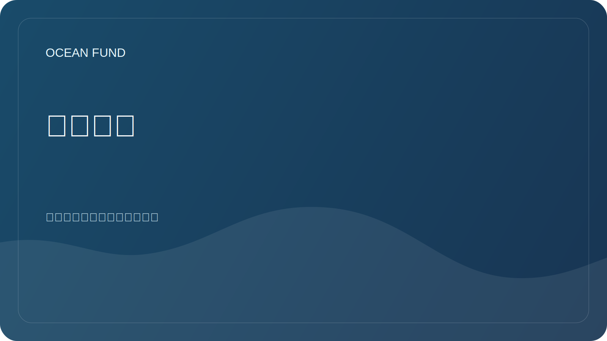

# 研究方向

本文件将基金会的使命与实际研究问题联系起来。该项目的主要公共动机之一：从地球的海洋到太空的海洋。

## 主要方向

| 方向 | 关键问题 | 第一个结果 |
| --- | --- | --- |
| 海洋生物多样性 | 如何基于开放数据描述海洋生态系统的状态？ | 来源审查、物种地图、指标清单 |
| 海洋和气候 | 海洋数据如何帮助解释气候变化？ | 变量、来源和可视化概述 |
| 海洋污染 | 哪些开放数据有助于追踪污染和人类影响？ | 污染类型和来源矩阵 |
| 海洋数据基础设施 | 如何让研究人员、开发人员和社会能够访问数据？ | 数据集注册表、笔记本、元数据规则 |
| 蓝色经济 | 如何在不做出毫无依据的承诺的情况下讨论可持续的海洋经济？ | 条款、案例、可持续性标准 |
| 海洋和太空 | 如何连接地球海洋、卫星数据、海洋世界和天体生物学？ | 回顾《地球作为一个海洋世界》，来源地图NASA/ESA/NOAA/哥白尼，叙述“从地球的海洋到太空的海洋” |

## 研究操作系统

为了深入、定期地研究该主题，使用工作协议 [`ocean-intelligence-system.md`](ocean-intelligence-system.md)。它描述了深度级别、监控自动化、结果格式以及法典如何处理海洋主题。

## 研究材料要求

- 区分事实、假设和计划；
- 注明来源和访问日期；
- 避免在没有支持的情况下发表政治和商业言论；
- 不发布敏感信息或个人信息；
- 编写以便国际合作伙伴可以阅读该材料。
