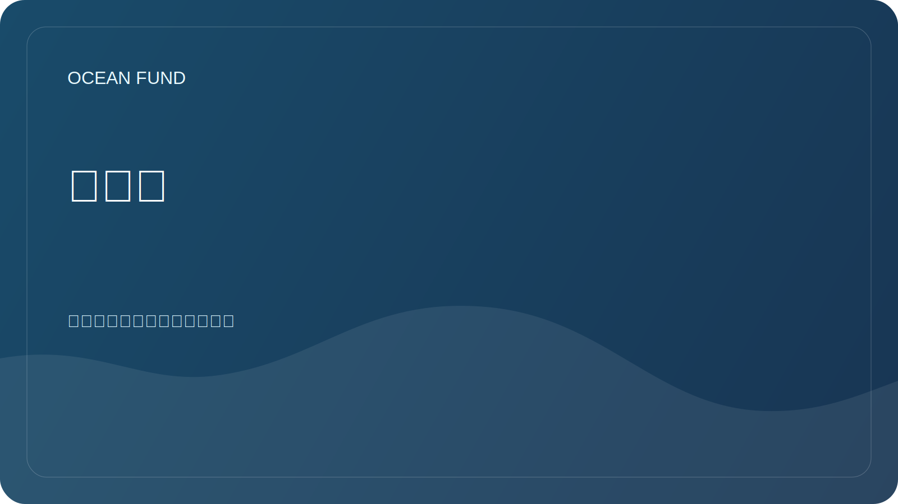

# 路线图

该路线图列出了接下来的实际步骤。它不承诺现成的结果，但有助于协调基金会的开放任务。

## 第一阶段.公共基地

| 任务 | 地位 | 结果 |
| --- | --- | --- |
| 创建 GitHub 存储库结构 | 进行中 | 自述文件、文档、研究、数据、外展、项目管理 |
| 将公共材料与内部材料分开 | 进行中 | 安全检查规则 |
| 准备问题和 PR 模板 | 进行中 | 任务的单点登录 |
| 描述使命和方向 | 进行中 | 合作伙伴和参与者的文件 |

## 第二阶段：研究和数据

- 创建开放数据源的主要寄存器。
- 描述有关生物多样性、气候、污染和数据基础设施的研究问题。
- 准备第一个没有私人数据的可玩笔记本。
- 定义引用来源和许可证的规则。

## 第三阶段：合作伙伴和活动

- 准备一份目标组织名单。
- 描述大学、博物馆、会议和基金会的合作形式。
- 创建第一封信和通信脚本。
- 为合作伙伴和活动准备简短的演示文稿。

## 第四阶段：公开大纲

- 设置 GitHub 讨论。
- 准备 GitHub Pages 作为文档展示。
- 添加存储库主题和描述。
- 核实材料后首次公开发布。

## 质量控制

- 每个关于合作伙伴关系、数据或项目状态的声明都必须有来源。
- 所有草稿均标记为草稿或需要验证。
- 包含个人、财务或敏感信息的数据不会被公开。
