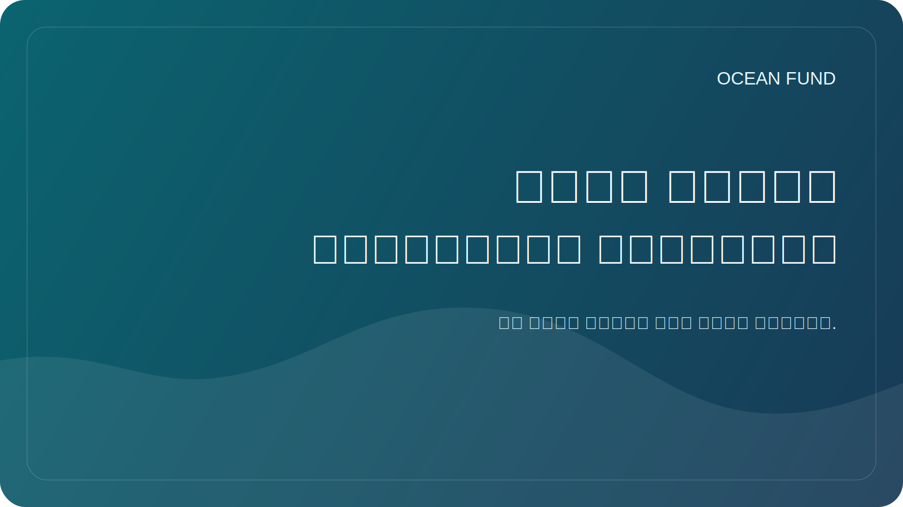

# مؤتمر / معرض صفحة واحدة

هذه الصفحة عبارة عن ملخص عام مدمج لمنظمي المؤتمرات، وفرق المنتديات، وأمناء المعارض، والمهرجانات العلمية، والمتاحف، وشركاء الفعاليات.

## صندوق المحيط

يعد Ocean Fund مركزًا مفتوحًا للمشروعات المتعلقة بالمحيطات والمناخ والتنوع البيولوجي والبيانات البحرية والتعليم والشراكات الدولية.

> من محيط الأرض إلى محيط الفضاء.

## لماذا يناسب صندوق المحيط الأحداث

تم تصميم Ocean Fund للتنسيقات العامة. يترجم المشروع علوم المحيطات والبيانات والتعليم والاستكشاف طويل المدى إلى تنسيقات يمكن أن تعمل على خشبة المسرح، وفي اللوحات، وفي ورش العمل، وفي مساحات العرض، وفي المحادثات عبر القطاعات.

## ما يمكننا إحضاره

- وسرد عام قوي يربط بين المحيطات والمناخ والتنوع البيولوجي والبيانات والاستكشاف؛
- تأطير قائم على العلم دون ادعاءات مبالغ فيها؛
- مواد مفتوحة المصدر وجاهزة للعامة؛
- تنسيقات الأحداث التي يمكن أن تتراوح من المحادثات القصيرة إلى وحدات المعرض؛
- جسر بين علوم المحيطات ومراقبة الأقمار الصناعية والتعليم العام والخيال من المحيط إلى الفضاء.

## المواضيع ذات الصلة

- علوم المحيطات والتنوع البيولوجي؛
- المناخ والقدرة على الصمود الساحلي؛
- البيانات البحرية ومراقبة الأرض؛
- العلم المفتوح والمعرفة العامة القابلة للتكرار؛
- التعليم المحيطي ومحو الأمية؛
- المتاحف والمعارض والاتصالات العامة؛
- التكنولوجيا الزرقاء والابتكار؛
- الأرض كعالم محيطي وروايات علمية تواجه الفضاء.

## صيغ المشاركة

- الكلمة الرئيسية أو الحديث المدعو؛
- مساهمة اللجنة؛
- ورشة عمل أو جلسة بيانات؛
- محاضرة عامة؛
- مفهوم المعرض أو الكشك؛
- شكل المتحف أو القبة السماوية التعليمية؛
- حدث جانبي أو محادثة شريك.

## مفاهيم الحدث الأول الجيد

- صندوق المحيط: بنية تحتية مفتوحة لأبحاث المحيطات، والبيانات، والتعليم، والمشاركة العامة؛
- من محيط الأرض إلى محيط الفضاء؛
- بيانات المحيطات المفتوحة للفهم العام والتعليم؛
- الأرض كعالم محيطي؛
- أعماق المحيطات، وعدم اليقين العميق، والعلوم العامة؛
- محو الأمية المحيطية من خلال البيانات والخرائط والتصور.

## ما يمكن أن يتوقعه المنظمون

- وصف عام موجز وقابل لإعادة الاستخدام؛
- نسخة جاهزة للتعاون لمواقع الويب والبرامج؛
- خطوات أولى صغيرة وملموسة بدلاً من تحديد المواقع الغامضة؛
- طرق التنسيق الآمنة العامة من خلال مستندات GitHub وتنسيقات المناقشة.

## الخطوة الأولى الآمنة العامة

ابدأ بالمعلومات العامة فقط:

- اسم الحدث وشكله؛
- الموضوع والجمهور المستهدف؛
- ما هو الدور المنطقي: المتحدث، عضو اللجنة، مضيف ورشة العمل، العارض، الشريك؛
- ما هي النتيجة العامة المتوقعة.

## الطريق العام الموصى به

1. Read [للشركاء](partners.md).
2. Read [شريك صفحة واحدة](partner-one-pager.md).
3. Read [نسخة المهمة العامة](mission-copy.md).
4. Review [نموذج طلب المؤتمر](../../outreach/conference-application-template.md).
5. انتقل إلى المناقشة العامة أو الخطوة التالية المتعقبة.

## قواعد الدعاية

- لا توجد شراكات أو متحدثين غير مؤكدين؛
- لا توجد اتصالات خاصة في المواضيع العامة.
- لا توجد شروط مالية في المناقشات العامة؛
- لا توجد ادعاءات مبالغ فيها بشأن مدى الوصول أو الحالة أو العمل المكتمل؛
- لا توجد مفاوضات خاصة في القضايا العامة.

## إعادة الاستخدام

هذه الصفحة الواحدة هي المرفق العام أو الرابط الموصى به لـ:

- تطبيقات المؤتمرات؛
- تطبيقات المعرض؛
- التواصل مع المنتدى؛
- رسائل البريد الإلكتروني الخاصة بشراكة الحدث؛
- مقدمات المتحدثين واللجنة؛
- مواد الاتصال الأولى للمتحف والمهرجان.
