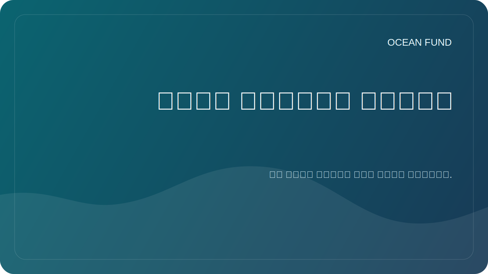

# حزمة تطبيق الحدث

هذه الصفحة عبارة عن حزمة عامة جاهزة للاستخدام لتطبيقات المؤتمرات ونماذج المعارض والتواصل مع الأحداث والتواصل مع المنظمين.

استخدامه جنبا إلى جنب مع:

- [مؤتمر / معرض صفحة واحدة](conference-exhibition-one-pager.md)
- [نسخة المهمة العامة](mission-copy.md)

## سيرة ذاتية قصيرة

يعد Ocean Fund مركزًا مفتوحًا للمشروعات المتعلقة بالمحيطات والمناخ والتنوع البيولوجي والبيانات البحرية والتعليم والشراكات الدولية. يبني المشروع بنية تحتية عامة للبحث والتعليم والتكنولوجيا تربط بين علوم المحيطات ومراقبة الأرض والمعرفة العامة والخيال من المحيط إلى الفضاء.

## السيرة الذاتية المتوسطة

يقوم Ocean Fund بتطوير الأبحاث المفتوحة والتعليم والبيانات والبنية التحتية للشراكة للعمل المتعلق بالمحيطات. يجمع المشروع بين العلوم البحرية والتنوع البيولوجي والمناخ ومراقبة الأقمار الصناعية والاتصالات العامة والمواد العامة القابلة لإعادة الاستخدام في بيئة واحدة جاهزة للتعاون. يربط إطارها العام محيط الأرض بمحيط الفضاء، مما يساعد على ترجمة العلوم والبيانات إلى تنسيقات مفهومة للمؤسسات والأحداث والجماهير الأوسع.

## السيرة الذاتية الموسعة

يقوم Ocean Fund ببناء بنية تحتية عامة لأبحاث المحيطات والبيانات والتعليم والمشاركة العامة والتعاون الدولي. تم تصميم المشروع كمركز مفتوح حيث يمكن للمؤسسات والباحثين والمتاحف والمطورين والمنظمات غير الربحية وشركاء الأحداث التواصل حول المعرفة التي تم التحقق منها والمواد الآمنة للجمهور وأشكال التعاون الملموسة. يساعد إطارها السردي، من محيط الأرض إلى محيط الفضاء، على ربط العلوم البحرية ومراقبة الأرض والتنوع البيولوجي والمناخ والتعليم والاستكشاف طويل المدى بطريقة صارمة ومقروءة ومفيدة للجمهور العام.

## الخيار الملخص 1: مقدمة عامة للمشروع

يقوم Ocean Fund ببناء بنية تحتية عامة مفتوحة لأبحاث المحيطات والبيانات البحرية والتعليم والتعاون بين القطاعات. تقدم هذه الجلسة المشروع كمركز عام منظم بدلاً من مجموعة فضفاضة من المواد، موضحة كيف يمكن للغة المهمة ومصادر البيانات واتجاهات البحث وتنسيقات الشراكة وسير العمل القائم على GitHub أن تدعم مبادرة جادة لتأثير المحيطات. الحديث ذو صلة بالجماهير المهتمة بعلوم المحيطات والتنوع البيولوجي والمناخ والتعليم والمعرفة المفتوحة وتكنولوجيا المصلحة العامة.

## الخيار الملخص 2: بيانات المحيطات والفهم العام

وتعتمد علوم المحيطات بشكل متزايد على البيانات المفتوحة، ومراقبة الأرض، والتفسير العام الواضح. تستكشف هذه الجلسة كيفية قيام Ocean Fund ببناء البيانات البحرية المفتوحة والأسئلة البحثية والمواد التي تواجه الجمهور حتى يتمكن العلماء والمعلمون والمطورون والمؤسسات من العمل من قاعدة مشتركة. وهو يركز على الترجمة العملية: كيفية الانتقال من مجموعات البيانات والمصادر التقنية إلى مخرجات عامة مفهومة وقابلة لإعادة الاستخدام وجاهزة للتعاون دون المبالغة في تقدير المطالبات أو فقدان الرعاية العلمية.

## خيار الملخص 3: السرد من المحيط إلى الفضاء

من محيط الأرض إلى محيط الفضاء هو أكثر من مجرد شعار. إنه إطار لربط العلوم البحرية، ومراقبة الأقمار الصناعية، ومحو الأمية في المحيطات، والاستكشاف طويل المدى في قصة عامة واحدة. تقدم هذه الجلسة صندوق المحيط كمنصة تربط النظم البيئية للمحيطات والمناخ والتنوع البيولوجي والبيانات وخيال الفضاء باعتباره المحيط القادم للاستكشاف. إنه مصمم للأحداث التي تريد سردًا قائمًا على العلم قادرًا على التحدث إلى الباحثين والمتاحف والبرامج التعليمية والجماهير العامة والشركاء متعددي التخصصات.

## خمسة عناوين للحديث

- صندوق المحيط: البنية التحتية المفتوحة لأبحاث المحيطات والبيانات والتعليم والمشاركة العامة
- من محيط الأرض إلى محيط الفضاء
- بيانات المحيط المفتوحة للتفاهم والتعاون العام
- الأرض كعالم المحيط
- بناء البنية التحتية العامة للمحيطات دون ضجيج

## قالب البريد الإلكتروني للمنظم

الموضوع: مساهمة محتملة من Ocean Fund إلى [اسم الحدث]

مرحبًا،

إنني أتواصل نيابةً عن Ocean Fund، وهو مركز مشروع مفتوح يركز على المحيطات والمناخ والتنوع البيولوجي والبيانات البحرية والتعليم والشراكات الدولية.

نعتقد أنه قد يكون هناك توافق قوي بين Ocean Fund و[Event Name]، خاصة فيما يتعلق بموضوعات مثل علوم المحيطات والمشاركة العامة والبيانات البحرية والتعليم والتنوع البيولوجي والمناخ والمعارض والحوار بين القطاعات.

يمكننا المساهمة بعدة أشكال، اعتمادًا على ما هو مفيد لبرنامجك:

- الحديث أو الكلمة الرئيسية.
- مساهمة اللجنة؛
- ورشة عمل أو جلسة بيانات؛
- مفهوم المعرض أو التعليم.
- حدث جانبي أو محادثة تواجه الشريك.

مواد أولية مفيدة:

- [مؤتمر / معرض صفحة واحدة](conference-exhibition-one-pager.md)
- [نسخة المهمة العامة](mission-copy.md)

إذا كان ذلك مناسبًا، يسعدنا استكشاف خطوة أولى صغيرة ومعرفة ما إذا كان هناك تطابق جيد مع جدول أعمالك الحالي.

أطيب التحيات،
صندوق المحيط
__الكود0__

قبل الإرسال، استبدل العناصر النائبة واستخدم معلومات الاتصال العامة المؤكدة فقط.

## ملاحظات الاستخدام

- استخدم السيرة الذاتية القصيرة عندما يكون النموذج ضيقًا.
- استخدم السيرة الذاتية المتوسطة لملفات تعريف المتحدثين أو الشركاء أو العارضين.
- استخدم السيرة الذاتية الموسعة عندما يطلب المنظم سياق المشروع الكامل.
- اختر الملخص الذي يتوافق بشكل أفضل مع موضوع الحدث بدلاً من فرض نسخة عالمية واحدة.
- اضبط البريد الإلكتروني للمنظم فقط بعد التحقق من جمهور الحدث وتنسيقه وحدود الكلمات.
