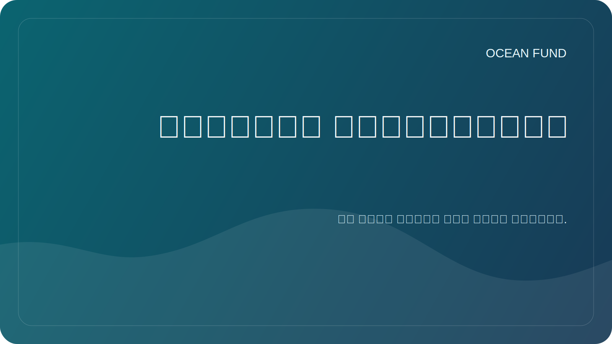

# الفهارس والمنشورات صفحة واحدة

تشرح هذه الصفحة كيف يتعامل صندوق المحيط مع الفهارس والمقالات والمنشورات والأطالس والموجزات العامة كجزء من نظام معرفي حي واحد.

## لماذا توجد هذه الطبقة

يتم تجزئة العمل في المحيط بسهولة. توضع الملاحظات البحثية في مكان واحد، والمقالات في مكان آخر، والشروحات العامة في مكان آخر، وفهارس البيانات في أنظمة منفصلة. يقوم صندوق المحيط ببناء هيكل حيث تعزز الفهارس والمنشورات وخرائط البيانات ومواد الأحداث ونصوص الشراكة بعضها البعض بدلا من الانجراف.

## ماذا نعني بالمؤشرات

بالنسبة لصندوق المحيط، يمكن أن يتضمن الفهرس ما يلي:

- خرائط مصدر البيانات؛
- سجلات مجموعة البيانات؛
- الأطالس التنظيمية؛
- قوائم جرد الموضوع؛
- طوابير النشر والمقالات؛
- حزم الأحداث والتوعية؛
- ملخصات تم التحقق منها لأنظمة المعرفة الداخلية أو الخارجية.

## ما ننشره

- ملخصات السلامة العامة؛
- لغة المهمة والحدث القابلة لإعادة الاستخدام؛
- ملخصات البحوث التي تواجه؛
- سجلات البيانات والمصدر؛
- الاستدعاء الفردي للشريك والحدث؛
- المواد التعليمية والتواصلية.
- طبقات المقالات والمقالات متعددة اللغات باللغات الرسمية الست للأمم المتحدة.

## ما لا ننشره

- وثائق خاصة؛
- اتصالات شخصية؛
- ادعاءات لم يتم التحقق منها؛
- الصادرات الداخلية الخام مع المعرفات؛
- التفاصيل المالية أو القانونية لم تتم الموافقة على نشرها للعامة.

## لماذا هذا مهم لصندوق المحيط

تسمح هذه الطبقة للمشروع بالاتصال:

- علم المحيطات؛
- البيانات البحرية والأقمار الصناعية؛
- التعليم العام؛
- المؤتمرات والمعارض.
- الشراكات والتعاون بين القطاعات؛
- الجسر من محيط الأرض إلى محيط الفضاء.

## إعادة الاستخدام

تعتبر هذه الصفحة مفيدة عند توضيح أن Ocean Fund لا يقوم ببناء المحتوى فحسب، بل يقوم أيضًا ببناء بنية الفهرس التي تسمح للمحتوى بالانتشار عبر البحث والتعليم والأحداث والتعاون العام.
