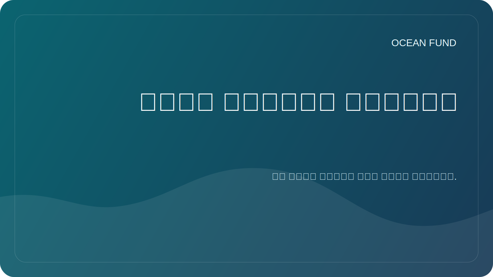

# نسخة المهمة العامة

هذه الصفحة عبارة عن طبقة مواجهة عامة مطلوبة لـ Ocean Fund. إنه موجود حتى يتمكن الشركاء ووسائل الإعلام والمساهمون والمؤسسات من إعادة استخدام وصف ثابت للمشروع دون تخمين كيفية تقديم التمويل.

## الصيغة الأساسية

الروسية:

> من محيط الأرض إلى محيط الفضاء.

إنجليزي:

> من محيط الأرض إلى محيط الفضاء.

## نسخة قصيرة

الروسية:

تقوم مؤسسة المحيط ببناء البنية التحتية للبحث والتعليم والتكنولوجيا المفتوحة للمحيطات والمناخ والتنوع البيولوجي والبيانات البحرية والشراكات الدولية.

إنجليزي:

يقوم Ocean Fund ببناء البنية التحتية للبحث والتعليم والتكنولوجيا المفتوحة للمحيطات والمناخ والتنوع البيولوجي والبيانات البحرية والشراكات الدولية.

## نسخة متوسطة

الروسية:

تجمع مؤسسة المحيط بين البحث والتعليم والبيانات البحرية وعمليات رصد الأقمار الصناعية والتعاون الدولي حول أهداف فهم المحيط وحمايته. يقوم المشروع ببناء بنية تحتية عامة يمكن من خلالها للعلماء والمتاحف والجامعات والمنظمات غير الحكومية والمطورين والمنظمات الشريكة التواصل والتعاون.

إنجليزي:

يربط Ocean Fund بين البحث والتعليم والبيانات البحرية ومراقبة الأرض والتعاون الدولي حول العمل على فهم المحيط وحمايته. يبني المشروع بنية تحتية عامة يمكن من خلالها للباحثين والمتاحف والجامعات والمنظمات غير الربحية والمطورين والمنظمات الشريكة الانضمام إلى العمل المشترك.

## نسخة موسعة

الروسية:

تقوم مؤسسة المحيط بتطوير منصة مفتوحة للأبحاث والتعليم والبيانات والتصورات المتعلقة بالمحيطات والشراكات الدولية. من المهم للمشروع الارتباط بين محيطات الأرض وملاحظات الأقمار الصناعية والمعرفة العامة وصورة الفضاء باعتباره محيط الاستكشاف التالي. ويساعد هذا المنطق في ربط علوم المحيطات، وأجندة المناخ، والتنوع البيولوجي، والأدوات الرقمية، والتعليم، والخيال طويل الأمد، في نظام عام واحد مفهوم.

إنجليزي:

يقوم Ocean Fund بتطوير منصة مفتوحة للبحث والتعليم والبيانات والتصور والشراكات الدولية المتعلقة بالمحيطات. يربط المشروع عمدا محيط الأرض بمراقبة الأرض والمعرفة العامة وخيال الفضاء باعتباره محيط الاستكشاف التالي. يساعد هذا الإطار على ربط علوم المحيطات، والعمل المناخي، والتنوع البيولوجي، والأدوات الرقمية، والتعليم، والخيال العام طويل المدى ضمن نظام عام واحد متماسك.

## قاعدة الاستخدام

استخدم هذه الصفحة كمصدر أساسي للأوصاف العامة في:

- ملف تعريف GitHub ونسخة المستودع؛
- التواصل مع الشراكة؛
- المناقشات ونماذج القضايا؛
- مقدمات العرض؛
- تطبيقات المؤتمرات والمعارض والمنتديات؛
- مواد الاتصال الأولى للمؤسسات.

عندما تكون في شك، استخدم النسخة القصيرة أو المتوسطة بدلا من ارتجال وصف جديد.
