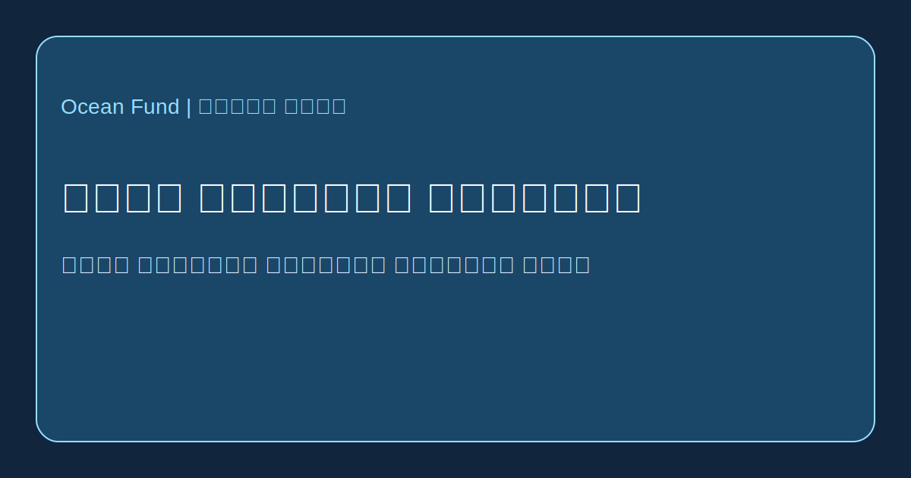

# اطلس الاعلام المحيطي

ترسم هذه الصفحة مجموعة اولى من وسائل الاعلام والمحررين ونماذج الاتصال العام التي تشكل طريقة كتابة قصص المحيط وتداولها.

تم التحقق من الصفحات العامة الرسمية في 13 مايو 2026.

## Focus

- Oceanographic Magazine: مجلة محيطية بصرية جدا تقودها اعمدة وشخصيات وروح استكشاف.
- Hakai Magazine: نموذج ارشيفي للسرد الطويل عن السواحل والعلم والمجتمع.
- Mongabay Oceans: صحافة بيئية سريعة وغنية بالمصادر وموجهة للمساءلة.
- Waterfront Alliance / City of Water Day: اتصال مدني حول الماء والمشاركة العامة في المدينة.

## لماذا يهم

يحتاج Ocean Fund الى فهم ليس فقط ماذا ينشر، بل كيف تجعل البنى التحريرية الكتابة عن المحيط واضحة وقابلة للتذكر.
