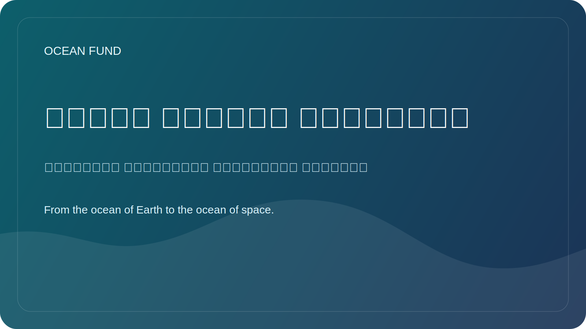

# خريطة الشبكة المحيطية

هذه الصفحة خريطة عامة مدمجة للمؤسسات الرئيسية، وبنى البيانات المفتوحة، والمسارات الحدثية المتكررة التي تشكل المنظومة المحيطية العالمية حول Ocean Fund.

تم التحقق من هذه الصفحة بالرجوع إلى المواقع الرسمية في 12 مايو 2026.

## لماذا توجد هذه الصفحة

يتوزع العمل المرتبط بالمحيط بين هيئات التنسيق الدولية، وأنظمة البيانات المفتوحة، ومنظمات المجتمع المدني، والمؤتمرات المتكررة. يحتاج Ocean Fund إلى خريطة عامة عملية توضح من يفعل ماذا وأين يمكن للمشروع أن يندمج بعد ذلك.

## العلم العالمي والتنسيق

- [Ocean Decade](https://oceandecade.org/) تنسق عقد الأمم المتحدة لعلوم المحيطات من أجل التنمية المستدامة، وتوفر إطارا عالميا للبرامج والعمل والمشاركة العامة.
- [GOOS](https://goosocean.org/what-we-do/) ينسق الرصد العالمي المستدام للمحيط ويربط بين القياسات والتنبؤات والخدمات التشغيلية.
- [OBIS](https://obis.org/about/) بنية مفتوحة رئيسية لبيانات التنوع البيولوجي البحري وسجلات ظهور الأنواع.

## البيانات المفتوحة والبنية التشغيلية

- [Copernicus Marine](https://marine.copernicus.eu/about) يقدم بيانات بحرية مفتوحة، وتنبؤات، وخدمات عن حالة المحيط.
- [EMODnet](https://emodnet.ec.europa.eu/en/about-emodnet) يجمع بيانات بحرية أوروبية قابلة للتشغيل البيني عبر مجالات موضوعية متعددة.

## العمل العام والمشاركة المدنية

- [Ocean Conservancy](https://oceanconservancy.org/) منظمة كبرى للمصلحة العامة تعمل عند تقاطع العلم والسياسة والعمل المجتمعي.
- [GenOcean](https://oceandecade.org/genocean/) هي حملة Ocean Decade المخصصة للتعبئة العامة ومشاركة المواطنين.

## المسارات الحدثية الرئيسية

- [UN Ocean Conference](https://sdgs.un.org/conferences/ocean2025/about-unoc-2025): عقد آخر مؤتمر في نيس من 9 إلى 13 يونيو 2025.
- [Our Ocean Conference](https://www.ouroceanconference.org/conferences/mombasa-2026/): النسخة المؤكدة التالية مقررة في مومباسا - كيليفي من 16 إلى 18 يونيو 2026.
- [Ocean Sciences Meeting](https://www.agu.org/ocean-sciences-meeting/about): عقدت نسخة 2026 في غلاسكو من 22 إلى 27 فبراير 2026.
- [Oceanology International](https://www.oceanologyinternational.com/london/en-gb/about.html): النسخة القادمة في لندن مقررة من 10 إلى 12 مارس 2026.
- [Ocean Business](https://www.oceanbusiness.com/): النسخة المؤكدة التالية مقررة في ساوثهامبتون من 6 إلى 8 أبريل 2027.

## مسارات عملية لـ Ocean Fund

- نشر موجزات عامة متعددة اللغات ومواد من صفحة واحدة موجهة حسب الموضوع؛
- متابعة دعوات المتحدثين، والفعاليات الجانبية، وفرص المعارض، والنقاشات العامة؛
- تحويل كل منظمة أو حدث مستهدف إلى بطاقة شريك، وبطاقة حدث، و issue للخطوة التالية؛
- الاقتراب من بنى البيانات وشبكات العلم العام عبر مواد عامة قابلة لإعادة الاستخدام بدلا من الرسائل المرتجلة.

## قاعدة العمل

استخدم المواقع الرسمية كطبقة مرجعية أولى. أعد التحقق من التواريخ، والحالات، وصيغ المشاركة قبل أي تصريح عام أو رسالة خارجية.
